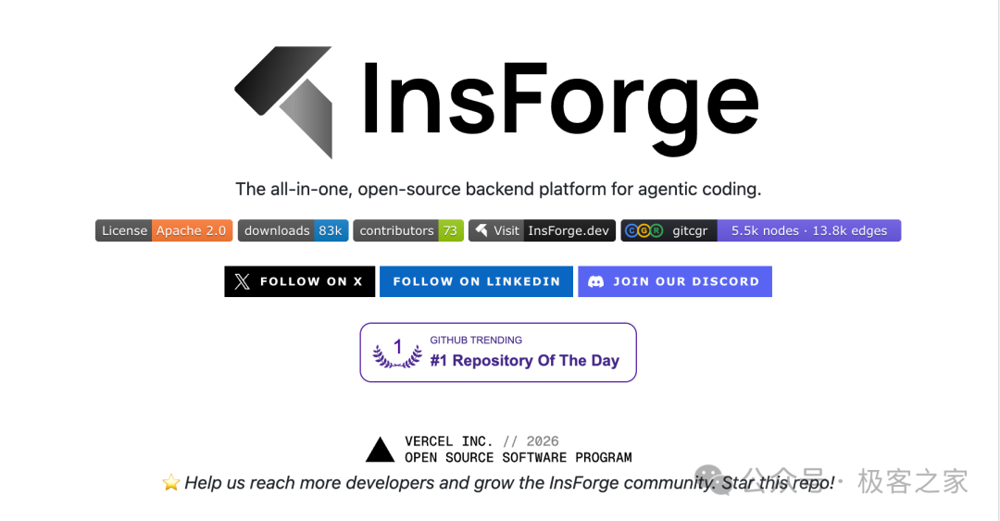
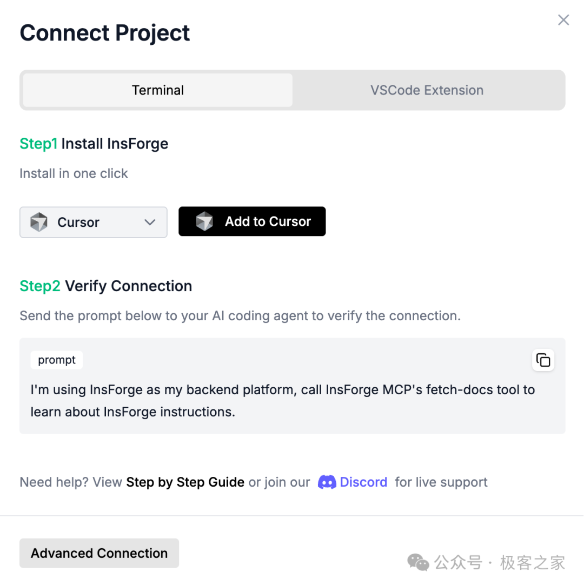
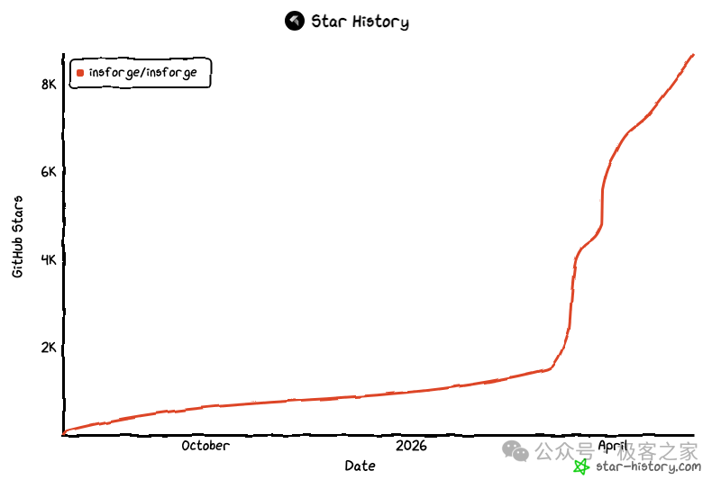
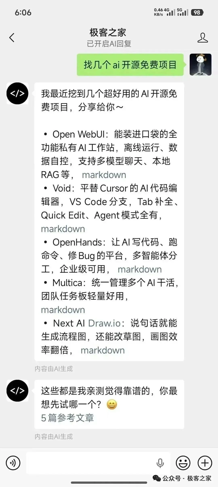

# 9.1k Star 的一站式 AI 后端神器：认证、存储、支付、部署，Agent 全包了！

> 公众号: 极客之家
> 发布时间: 2026-05-09 10:05:00
> 原文链接: https://mp.weixin.qq.com/s/4izUCuUyL5b16EPjlzXIvA

---


用 Claude Code 或者 Cursor 写项目，最让人头疼的不是业务逻辑，是后端。

每次新开一个项目，我都要重新折腾一遍：创建数据库、配认证、搞 S3 存储、写 Edge Function……这些事情做多了，真的很烦。Agent 帮你生成了一堆前端代码，转头就卡在「你需要先配好数据库」这里。Agent 写代码很快，但它没法直接碰你的后端。

这个卡点，InsForge 想来解决。



# InsForge 是什么

InsForge 是一个面向 AI 编程 Agent 的开源后端平台。GitHub 上已有 9.1k stars，Apache 2.0 协议，YC 背书。

它的定位和 Supabase 或 Firebase 不完全一样。Supabase 是给人用的，InsForge 是给 Agent 用的。工程师面对的是一个控制台， Agent 面对的是一个 MCP Server。

InsForge 给 Agent 暴露的不是一堆 REST API，而是后端的「上下文」：Schema 结构、表关系、RLS 权限配置、已投运的函数、日志运行状态……Agent 把这些信息吃透，才能真正理解并操作你的后端，而不是盲目猜接口。

# Agent 怎么和它协作

InsForge 给 Agent 提供了两种接入方式。

一种是 **MCP Server**。无论是云端还是自托管，InsForge 都会持有一个 MCP Server。Agent 连上去，就能用自然语言调用后端操作：跑数据库迁移、创建存储桶、配置认证提供方、获取运行日志……都在这一个入口完成。

另一种是 **CLI + Skills**（仅在云端可用）。Agent 可以在终端里直接调用 InsForge CLI，执行对应的 Skill。这种方式不需要在本地跑任何服务，直接云端调用。

两种方式的目标都一样：**让 Agent 像后端工程师一样操作后端。** Agent 不仅能写代码，还能拉取文档、查 Schema、看日志、配置资源。Agent 写完不确定运没运，可以直接打开日志确认，而不是来回切换工具。

目前已经官方展示支持的 coding agent 包括：Cursor、Claude Code、GitHub Copilot、Codex、Cline、Windsurf、Kiro、Trae、Roo Code 等。

MCP 连接配置界面

# 七大核心能力

### 数据库（Database）

PostgreSQL，每个项目独立一个实例。内置 pgvector，向量搜索和嵌入（Embedding）拿来就能用。Agent 可以直接读取 Schema、执行迁移、创建表，不需要人手动参与。

### 身份认证（Authentication）

用户注册、登录、Session 管理全内置。支持 JWT 和 OAuth，也就是 Google 登录、GitHub 登录这种常见需求拿来就用。Agent 可以直接配置认证提供方，不用手动去控制台点。

### 文件存储（Storage）

S3 兼容存储。图片、视频、任何文件都能放。Agent 可以创建存储桶、配置访问权限、上传文件。

### Edge Functions

基于 Deno，无服务器运行后端逻辑。Agent 可以写、部署、更新 Edge Function，全程不用人介入。

### Model Gateway

一个统一的 OpenAI 兼容接口，后面对接多个 LLM 提供商。项目里要调用 Claude、GPT 或者其他模型，统一进这一个网关。不用每个模型单独配密钥和基础 URL。

### 实时（Realtime）

基于 WebSocket 的发布/订阅机制。数据发生变化，订阅的客户端即时收到推送。内置 RLS 权限控制，谁能看到哪些数据由权限策略控制。

### 部署（Site Deployment）

Agent 写完前端代码，可以通过 InsForge 直接部署上线。代码分析、确定构建策略、注入环境变量、监控部署状态，全流程 Agent 自主处理。最新 v2.1.1 还加入了 Stripe 支付集成，独立开发者做产品又少了一道手动配。

# 拿数据说话

现在有个叫 MCPMark 的基准测试，专门衡量 AI 处理后端数据库任务的表现。InsForge 跟主流 BaaS 平台对比后，有几个关键数据：

| 指标 | InsForge | Supabase | 原生 Postgres |
| --- | --- | --- | --- |
| 完成时间 | 150s | 239s | 215s |
| Token 用量 | 8.2M | 11.6M | 10.4M |
| 准确率 | 47.6% | 28.6% | 38.1% |

数据来自 MCPMark 官方榜单。完成同样任务，比 Supabase 快 1.6 倍，用的 Token 少 30%，准确率高 1.7 倍。

差距这么大，原因并不神秘。InsForge 把后端的 Schema、表关系、RLS 语境全部展开给 Agent， Agent 不用试探接口。而传统方式是 Agent 自己去碰 API，碰不对就重试，浪费很多。

InsForge GitHub Star 增长趋势

# 上手：云端和自托管两条路

### 云端（insforge.dev）

最快的方式。去 insforge.dev 注册一个账号，创建项目，拿到 API Key 和项目 URL。然后用下面这个命令把 MCP 连接到 Cursor：

```
npx @insforge/install --client cursor --env API_KEY=你的Key --env API_BASE_URL=你的项目 URL
```

Claude Code 这边则是：

```
claude mcp add insforge npx -- -y @insforge/mcp@latest --env API_KEY=你的Key --env API_BASE_URL=你的项目 URL
```

连接好了发一条消息给 Agent：“我在用 InsForge 当后端，请调用 InsForge MCP 的 fetch-docs 工具学一下操作说明。” Agent 回复说已经读到指令集，连接成功。

### 自托管（Docker Compose）

想自己持有数据，或者内网环境用，可以跑 Docker 版本。前提是装好 Docker 和 Node.js。

```
git clone https://github.com/insforge/insforge.git
cd insforge
cp .env.example .env
docker compose -f docker-compose.prod.yml up
```

就这四条，本地跑起来。访问 `http://localhost:7130` 配置 MCP 连接。

如果连 Docker 都不想装，还有一键部署选项：Railway、Zeabur、Sealos 这三个平台都已经就绪了模板，点一下就跑。

# 总结一下

我自己小结一下 InsForge 适合谁用。

如果你在用 Claude Code 或 Cursor 做项目，后端配置从来都是最让你头疼的环节，那 InsForge 至少得了解一下。它把后端配置这块直接交给 Agent，不用来回切换界面。

如果你是独立开发者，一个人把一个产品弄完整，后端这块能交出去就是收益。数据库、认证、存储、支付、部署，InsForge 展示的这些能力 Agent 几乎全部能接管。

**开源地址**：https://github.com/InsForge/InsForge


*****点击下方卡片，关注极客之家*****

这个公众号曾分享过许多有趣的开源项目。如果你不想逐篇翻阅历史文章，也可以直接关注微信公众号“极客之家”，通过后台留言与我们互动交流

