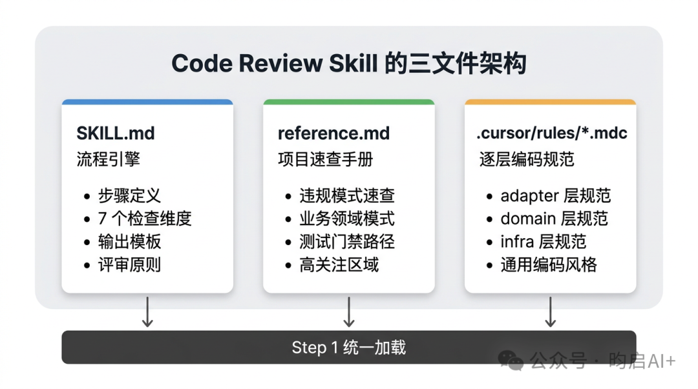

# Agent Skill 实战：一个Code Review Skill 的诞生记（上）

> 公众号: 昀启AI+
> 发布时间: 2026-03-25 23:20:57
> 原文链接: https://mp.weixin.qq.com/s/AriUW68msqAl5MshWlUHRQ

---


在上一篇《[面向产研体系的 Skill 与 Sub-agent 的分层设计](https://mp.weixin.qq.com/s?__biz=MzU5NDY2NzQyNw==&mid=2247483771&idx=1&sn=65b0bc2dab20bc2ce376a2ab625e40fd&scene=21#wechat_redirect)》聊了 Skill 怎么设计：什么场景值得沉淀、该抽象到什么粒度、和 Sub-agent 是什么关系。有同学留言说能不能直接给个能抄的示例？

说实话，能直接抄的模板不存在。团队技术栈不同、规范不同，照搬别人的 Skill 大概率水土不服。但骨架是通用的，关键在于怎么把你自己团队的工程规范“填”进去。

所以这篇文章仍以 COLA 5.0 + Spring Boot 的工程结构为例，完整描述一个可用的 Code Review Skill。不过要全部讲清楚实在太长，我把它拆成了上下两篇。上篇先解决一个问题：**一个 Skill 到底长什么样，以及它的骨架应该怎么搭。**

## 一个完整的 Skill 示例

##

先直接放一个 md 格式的完整示例。但你先别着急 Copy，就像 Nginx 配置文件，拿到了还得根据你的实际情况改一改。我主要想通过一个完整的描述，比较直观地说清楚 Skill 长什么样，但离你能直接用还是有一段距离的。

一个 Skill 目录通常包含两个文件：

- **SKILL.md**：流程引擎，定义 Agent “怎么做”
- **reference.md**：项目速查手册，提供“这个项目有什么特殊情况”

其中 `SKILL.md` 由四个部分组成：

- **Frontmatter**：路由。Agent 靠它判断“这个 Skill 跟我有关吗”
- **概述**：锚点。防止 Agent 执行到一半忘记自己在干什么
- **工作流程**：引擎。强制 Agent 按步骤来，不许自由发挥
- **原则**：兜底。步骤没覆盖到的边界情况，靠原则做判断

完整示例如下：


```perl
---
name: code-review
description: >-
  按团队编码规范和 COLA 架构约定进行代码评审，输出分级反馈报告。
  同时识别代码异味和技术债务。
  当用户说"代码评审"、"CR"、"review"、"检查代码质量"、"技术债务"时使用。
---
# 代码评审 (Code Review)
## 概述
按团队编码规范和 COLA 5.0 架构约定对代码进行系统性评审。输出分级反馈报告（Critical / Warning / Suggestion / Good），覆盖架构合规、安全、性能、可读性、代码异味等维度。

---
## 工作流程
### Step 1: 确定评审范围
通过用户输入确定评审目标，支持三种方式：

| 输入方式 | 说明 |
|---------|------|
| 指定文件/目录 | 评审指定路径下的代码 |
| Git diff | 评审指定分支/commit 间的变更 |
| 模块名 | 评审整个业务模块（application/{module} + 关联的各层代码） |

**确定评审范围后，读取以下上下文：**
1. 待评审代码的完整内容
2. 代码所在模块的上下文（被调用方/调用方）
3. 项目 `.cursor/rules/` 下的相关规则文件（按代码所在层选择）：

| 代码层 | 对应规则 |
|--------|---------|
| adapter/web | `adapter-web.mdc` |
| adapter/mq | `adapter-mq.mdc` |
| application | `application-service.mdc` |
| domain | `domain-layer.mdc` |
| infrastructure | `infrastructure-impl.mdc` |
| 通用 | `cola-architecture.mdc`、`java-coding-style.mdc` |

### Step 2: 逐维度检查
按以下 7 个维度逐项检查，每个维度独立输出结果。
---
#### 维度 1：架构合规（COLA 分层）
| 检查项 | 说明 |
|--------|------|
| 依赖方向 | adapter → application → domain ← infrastructure，禁止反向依赖 |
| Gateway 抽象 | Service 是否通过 Gateway 接口访问数据，而非直接注入 Mapper |
| domain 零依赖 | domain 包内是否引入了 Spring/MyBatis/MapStruct 等框架注解 |
| Entity 使用时机 | 有状态流转/业务计算时是否用了 Entity；纯查询是否错误引入 Entity |
| 层间数据传递 | 各层是否用了正确的数据对象（Request → DTO → Entity/DO） |
---
#### 维度 2：编码规范
| 检查项 | 说明 |
|--------|------|
| 命名规范 | 类名 PascalCase，DTO 后缀全大写，URL kebab-case，JSON snake_case |
| 依赖注入 | 是否用 `@RequiredArgsConstructor` + `private final`（禁止 `@Autowired` 字段注入） |
| MapStruct | Convertor 是否用 `INSTANCE` 单例，`id`/审计字段是否 `ignore = true` |
| 异常处理 | Controller 是否有 try-catch 兜底；Service 是否抛出有意义的业务异常 |
| 事务管理 | 写操作是否有 `@Transactional(rollbackFor = Exception.class)` |
| 日志规范 | 关键操作是否有日志；日志级别是否合理；是否打印了敏感信息 |
---
#### 维度 3：SOLID 原则
| 检查项 | 违反信号 |
|--------|---------|
| 单一职责（SRP） | 一个 Service 超过 300 行；一个方法超过 50 行；混合了不相关的业务逻辑 |
| 开闭原则（OCP） | 大量 if-else/switch 分支，新增类型需要修改已有代码 |
| 里氏替换（LSP） | 子类覆写了父类行为导致异常 |
| 接口隔离（ISP） | Gateway 接口方法过多（>10），调用方只用其中 1-2 个 |
| 依赖倒置（DIP） | 高层模块直接依赖具体实现而非接口 |
---
#### 维度 4：安全
| 检查项 | 说明 |
|--------|------|
| SQL 注入 | 是否使用了字符串拼接 SQL（应使用 MyBatis 参数绑定） |
| 参数校验 | 入口参数是否有 `@Valid` + JSR-303 注解 |
| 敏感数据 | 日志/响应中是否暴露了敏感信息（密码/密钥/证件号/手机号） |
| 数据权限 | 查询是否校验了当前用户的数据权限范围 |
| 接口鉴权 | 接口是否配置了权限控制 |
---
#### 维度 5：性能
| 检查项 | 说明 |
|--------|------|
| N+1 查询 | 循环中是否有数据库查询（应批量查询后 Map 关联） |
| 大表全表扫描 | 查询条件是否命中索引 |
| 不必要的远程调用 | 循环中是否有 HTTP/RPC 调用 |
| 内存风险 | 是否有未分页的全表查询；大集合是否有 size 上限 |
| 事务范围过大 | 长事务中是否包含了远程调用/耗时操作 |
---
#### 维度 6：可维护性
| 检查项 | 说明 |
|--------|------|
| 重复代码 | 是否有复制粘贴的代码块（应抽取公共方法） |
| 魔法值 | 是否有硬编码的数字/字符串（应定义常量或枚举） |
| 方法复杂度 | 单方法是否嵌套过深（>3 层）或分支过多 |
| 组合方法模式 | 公开方法是否做到了只编排调用，每步有独立的私有方法 |
| 注释质量 | 是否有过时/误导性注释；复杂业务逻辑是否缺少注释 |
---
#### 维度 7：测试充分性
| 检查项 | 说明 |
|--------|------|
| 单测覆盖 | 核心业务逻辑是否有单元测试 |
| 边界测试 | 空值/空集合/最大值/最小值是否覆盖 |
| 异常路径 | 异常分支是否有对应测试 |
| 断言质量 | 是否使用 AssertJ 链式断言；是否只 assert 了不抛异常 |
---

### Step 3: 生成评审报告
按以下模板输出结构化报告：
```markdown
# 代码评审报告
**评审范围**：{文件列表 / diff 范围}
**评审日期**：{YYYY-MM-DD}

## 评审摘要
| 级别 | 数量 | 说明 |
|------|------|------|
| 🔴 Critical | {N} | 必须修复：安全漏洞/架构违规/数据错误 |
| 🟡 Warning | {N} | 建议修复：性能隐患/规范违反/可维护性 |
| 🟢 Suggestion | {N} | 优化建议：代码风格/可读性/最佳实践 |
| ✅ Good | {N} | 值得肯定的实践 |

## 详细反馈
### 🔴 Critical
#### C1: {问题标题}
- **文件**：`{文件路径}` L{行号}
- **问题**：{描述}
- **影响**：{风险说明}
- **建议**：{修复方案，给出代码示例}
### 🟡 Warning
（同上结构）
### 🟢 Suggestion
（同上结构）
### ✅ Good
- {值得肯定的实践 1}
- {值得肯定的实践 2}
## 总结与建议
{整体评价，1-3 句话}
{如有系统性问题，指出根因和改进方向}
```
### Step 4: 输出
1. 将报告展示给用户
2. 如用户要求保存，写入 `doc/code-review/{模块名}-review-{YYYY-MM-DD}.md`
---

## 评审原则
- **对事不对人**：反馈针对代码而非作者，使用"这段代码"而非"你"
- **给方案不只指问题**：每条 Critical/Warning 必须附带具体的修复建议或代码示例
- **肯定好的实践**：Good 部分不可省略，至少列出 1 条值得肯定的点
- **区分严重性**：不把所有问题都标 Critical，准确分级避免"狼来了"
- **项目约定优先**：以项目 `.cursor/rules/` 中的约定为准，不强推团队未采纳的实践
```


与 `SKILL.md` 配套的还有一个 `reference.md`，它是 Agent 执行评审时的项目速查手册。比如我们团队的 `reference.md` 包含这些内容（节选）：


```perl
# code-review 速查附录（xxx-service）

供执行评审 Step 1 / Step 3 时按需查阅。本文件只放“速查表”和“模式速查”，检查逻辑见 SKILL.md。

## 1. 规则文件速查

| 规则文件 | 触发条件 | 核心约束一句话 |
|----------|---------|---------------|
| `cola-architecture.mdc` | alwaysApply | 依赖单向 adapter→app→domain←infra；Gateway 必须有；Entity 按需 |
| `adapter-web.mdc` | `**/adapter/web/**` | 四件套注解；private final 注入；try-catch 兜底；URL kebab-case |
| `domain-layer.mdc` | `**/domain/**` | 零框架依赖；Gateway 纯接口；Entity 充血模型；DP 枚举 |
| ... | | |

## 2. COLA 常见违规模式（Critical 级速查）
| # | 违规模式 | 位置信号 |
|---|---------|---------|
| V1 | domain 包 import Spring/MyBatis/MapStruct | `domain/**` 出现 `org.springframework` |
| V2 | ServiceImpl 直接注入 Mapper | application 类 `private final XxxMapper` |
| V3 | GatewayImpl 调用其他 GatewayImpl | infrastructure 类注入另一个 `*GatewayImpl` |
| ... | | |

## 3. 外部平台调用链速查（项目特有业务模式）
| 错误类型 | 含义 | 对应 Response 工厂方法 |
|---------|------|----------------------|
| NONE | 无错误 | Response.success() |
| PLATFORM_ERROR | 平台级错误 | Response.platformError() |
| BUSINESS_ERROR | 业务级错误 | Response.businessError() |
| LOCAL_ERROR | 本地错误 | Response.error("LOCAL_ERROR", ...) |

## 4. 测试门禁路径
（变更触及以下路径时，缺少对应测试升级为 Critical）
...
```


注意 `reference.md` 开头那句话：“本文件只放速查表和模式速查，检查逻辑见 SKILL.md。”这就是两个文件的分工边界。`SKILL.md` 定义“按什么流程、什么维度去检查”，`reference.md` 回答“这个项目有哪些已知的违规模式和特殊业务知识”。

以上就是一个完整的 Code Review Skill 目录的两个文件。接下来逐层拆解 `SKILL.md` 是怎么填内容的，以及它和 `reference.md`、`.mdc` 规则文件是怎么配合工作的。

## 逐层拆解 Code Review Skill

##

### Frontmatter：让 Agent 知道什么时候该调用


```makefile
name: code-review
description: >-
  按团队编码规范和 COLA 架构约定进行代码评审，输出分级反馈报告。
  同时识别代码异味和技术债务。
  当用户说"代码评审"、"CR"、"review"、"检查代码质量"、"技术债务"时使用。
```


这段 frontmatter 看起来简单，其实承担了 Skill 的“路由”功能。`description` 里同时做了三件事：

- **说清楚能力边界**：告诉 Agent 这不是通用 CR，而是绑定了特定技术栈的 CR
- **说清楚输出形态**：告诉 Agent 最终不是散乱建议，而是分级反馈报告
- **列出触发词**：匹配用户真实用语，比如“代码评审”“CR”“review”

写法要点：`description` 同时面向两个读者：Agent 用它判断是否匹配，人用它快速理解能力范围。触发词一定要覆盖团队的真实用语习惯，比如你们团队管 CR 叫“过代码”，那就把“过代码”加进去。

### 概述：给 Agent 一个执行纲领

概述只有一句话，但要回答三个问题：按什么标准？输出什么？覆盖哪些维度？

它的作用是全程锚定。Agent 在执行过程中会反复参照概述来判断“我现在做的事情是不是偏了”。概述写得含糊，后续每一步都可能偏移。

### 工作流程：Skill 的核心引擎

工作流程是整个 Skill 中最重的部分。`code-review` 分为四步，每一步都有明确的设计考量。

#### Step 1：确定评审范围 + 加载上下文

####

这一步做了两件事。

**第一件是明确输入方式**（指定文件、Git diff、模块名）。不定义的话，Agent 就会自己猜。今天看 diff，明天扫全项目，输出一会儿准一会儿飘。

**第二件是定义上下文加载策略**。这是 Skill 和“一段 Prompt”最本质的区别。

注意 `SKILL.md` 里 Step 1 的加载顺序：

先读 `reference.md` 获取项目级的违规模式速查和高关注区域;

再按代码包路径从路由表中加载对应层的 `.mdc` 规则文件（adapter/web 层加载 `adapter-web.mdc`，domain 层加载 `domain-layer.mdc`）;

最后加上通用的 `cola-architecture.mdc` 和 `java-coding-style.mdc`。

这就引出了一个关键设计：**一个完整的 Skill，其实由三个文件协作**，而不是只有 `SKILL.md` 。



**三个文件各管什么？**

| 文件 | 职责 | 内容示例 |
| --- | --- | --- |
| **SKILL.md** | 流程引擎，定义“怎么评审” | 步骤（确定范围→逐维度检查→输出报告）、7 个检查维度、报告模板、评审原则 |
| **reference.md** | 项目速查手册，定义“这个项目要额外注意什么” | 常见违规模式速查表、业务领域特有模式、测试门禁路径、高关注区域及其加权检查点 |
| **.mdc 规则文件** | 逐层编码规范，定义“每一层的代码应该长什么样” | `adapter-web.mdc`、`domain-layer.mdc`、`unit-test.mdc` 等 |

**为什么不把所有内容都写在 `SKILL.md` 里？**

三个原因：

1. **按需加载，省 Token**：评审 Controller 只加载 `adapter-web.mdc`，不加载 `domain-layer.mdc`
2. **独立维护**：编码规范更新了改 `.mdc`，业务模式变了改 `reference.md`，流程不变就不动 `SKILL.md`
3. **跨 Skill 复用**：同一套 `.mdc` 规则文件可以被 `code-review`、`generate-unit-test` 等多个 Skill 共享

**`reference.md` 和 `.mdc` 规则文件有什么区别？**

简单说，`.mdc` 是“写代码时就该遵守的规范”，`reference.md` 是“评审时需要额外速查的项目知识”。比如“Controller 禁止包含业务逻辑”是规范，而“外部平台调用链的 ResponseWrapper 有四种错误类型、每种对应不同的 Response 工厂方法”是项目特有的业务知识。

#### Step 2：逐维度检查，7 个维度形成检查框架

####

7 个维度是这个 Skill 的执行主体。每个维度对应一类独立的质量关注点，维度之间不重叠，合在一起覆盖代码评审的核心要素。

这里有一个关键的写法原则：**每个检查项都必须带“违反信号”，而不是只有一个名字。** Agent 不是老员工，没有经验直觉。跟它说“注意单一职责”，它只会回一句“看起来还行”；换成“Service 超过 300 行就是违反、方法超过 50 行就是违反”，它就能老老实实数行数了。

所以 `SKILL.md` 里每一条检查项的写法都是：**检查什么 + 什么情况算违反 + 应该怎么做**。

比如：

- 依赖注入：“是否用 `@RequiredArgsConstructor` + `private final`”，而不是“检查依赖注入方式”
- N+1 查询：“循环中是否有数据库查询（应批量查询后 Map 关联）”，而不是“注意性能问题”
- 断言质量：“是否使用 AssertJ 链式断言；是否只 assert 了不抛异常”，而不是“检查测试质量”；

这个原则适用于所有类型的 Skill，不只是 code-review。

#### Step 3 & 4：输出模板 + 交付

报告模板定义了精确的输出格式。

四级分类、每条反馈的固定结构（文件+行号、问题、影响、建议），这些都要提前定好。没有模板，Agent 每次输出格式都不一样，团队无法形成阅读习惯。模板太宽松（只说“输出一份报告”），Agent 还会自行决定详细程度。

报告的保存路径 `doc/code-review/{模块名}-review-{YYYY-MM-DD}.md` 看起来是小细节，但意味着评审报告天然可追溯、可归档，后续还能做趋势分析。

### 4. 评审原则：兜底的价值观

步骤不可能覆盖所有边界情况。原则就是 Agent 在灰色地带的决策依据。

五条原则里，最容易被忽视但最有用的是两条：

- **区分严重性**：没有这条，Agent 容易把所有疑似问题都标 Critical，几次之后团队就不信任评审报告了；
- **项目约定优先**：明确告诉 Agent 以 `.cursor/rules/` 中的约定为准，不要自作主张推荐团队没有采纳的最佳实践；

## 下篇预告:

上篇把骨架搭起来了，但真正决定 Skill 能不能落地的，其实是后半程：**怎么把通用骨架翻译成你团队自己的工程规范，怎么理解 Token 消耗，以及怎么把这套方法推广到其他 Skill。**

所以下篇继续讲三件事：

1. 怎么做本地化，把“团队约束和经验”翻译成“Agent 可执行的检查标准”。
2. 我们曾经用裸 Prompt 交过的学费，以及结构化 Skill 为什么更省钱。
3. 怎么把 Code Review 这套写法迁移到 `write-prd` 等其他 Skill。

下篇见：《Agent Skill 实战：一个 Code Review Skill 的诞生记（下）》

###

###


