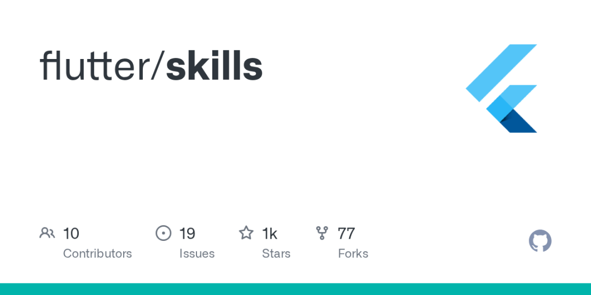
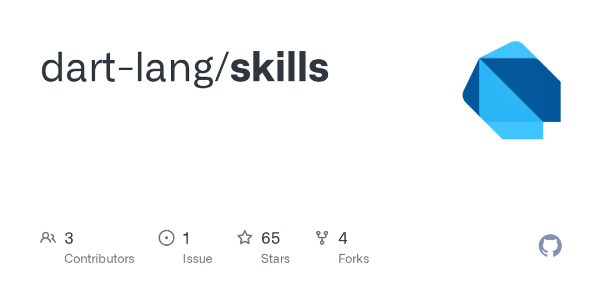
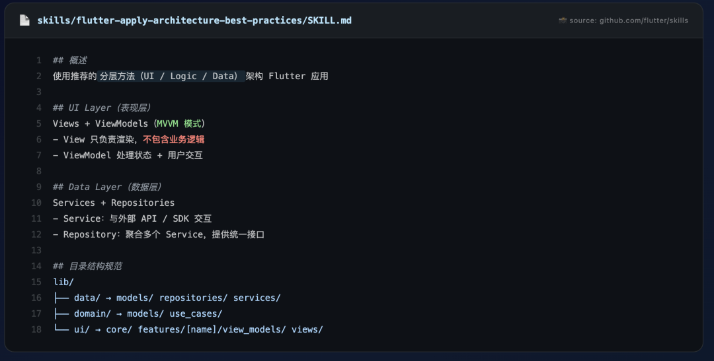
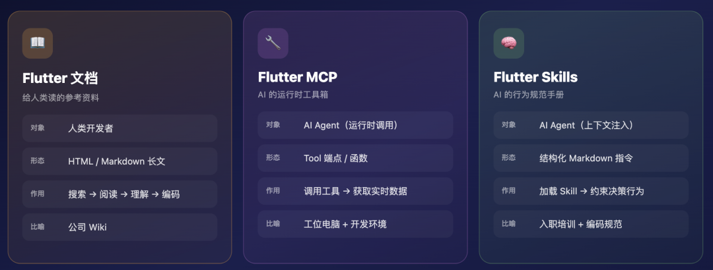
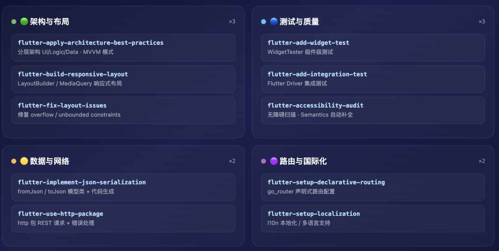
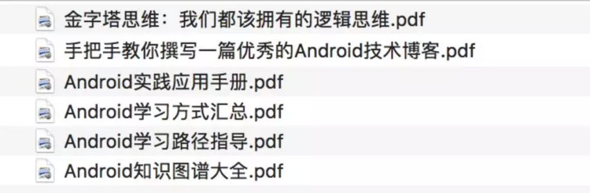

# Flutter 官方 Skills：让你的 AI 写出「专家级别」代码

> 公众号: Carson带你学Android
> 发布时间: 2026-05-18 08:05:00
> 原文链接: https://mp.weixin.qq.com/s/S-ZWhQOTwSw9lsJgyz5zkQ

---


# 前言

AI Agent 越来越能写代码了，但写出来的 Flutter 代码质量参差不齐——因为它只会查文档、猜用法，不懂 Flutter 的「最佳实践」和「隐性规范」。

Flutter 官方的解法是：**直接给 AI 一套教材Skill**——`flutter/skills`，10 个面向任务的技能模块，一条命令安装到你的工程里，让你立刻变成 Flutter 老司机。



---

# flutter/skills 是什么

Flutter 官方维护的 **Agent Skill 仓库**——一组以 Markdown 编写的结构化知识文件，专门喂给 AI 编码助手，让它在帮你写 Flutter 代码时遵循官方推荐的架构、模式和最新 API。

> ❝
>
> 姊妹项目 dart-lang/skills 则覆盖 Dart 语言层面的技能，两者建议一起安装。



## 它不是文档，是「行为指令」

- 传统文档是给**人**读的，解释「这个 API 干嘛的、参数是什么、返回值是什么」；
- 而 Skill 文件是给 **AI Agent** 读的，告诉它「在这个场景下，你应该怎么做、不应该怎么做、优先用哪个方案」。

举个例子，`flutter-apply-architecture-best-practices` 的 `SKILL.md` 里不会像文档一样列出各种架构方案的 API 列表，而是直接规定：

- 使用推荐的分层方法（UI / Logic / Data）架构 Flutter 应用
- UI Layer 用 Views + ViewModels（MVVM 模式）
- Data Layer 用 Services + Repositories
- View 只负责渲染，不包含业务逻辑。



这就是「行为指令」和「参考文档」的本质区别——**前者约束 AI 的决策，后者只提供信息**。

## 仓库结构一览

> ❝
>
> 📸 官方仓库：https://github.com/flutter/skills

```
flutter/skills/
├── .github/                ← CI / Issue 模板
├── resources/
│   └── flutter_skills.yaml ← 技能元数据
├── skills/                 ← 10 个技能子目录
│   ├── flutter-accessibility-audit/
│   ├── flutter-add-integration-test/
│   ├── flutter-add-widget-preview/
│   ├── flutter-add-widget-test/
│   ├── flutter-apply-architecture-best-practices/
│   ├── flutter-build-responsive-layout/
│   ├── flutter-fix-layout-issues/
│   ├── flutter-implement-json-serialization/
│   ├── flutter-setup-declarative-routing/
│   └── flutter-setup-localization/
├── tool/
├── pubspec.yaml
└── README.md
```

- 每个子目录下有一个 `SKILL.md` 文件，就是该 Skill 的完整内容。
- AI Agent 在对话时会按需加载相关 Skill 到上下文中（类似 Flutter 的延迟加载），让回答精准命中当前开发场景。

---

# Skill vs MCP vs 文档

这是最多人搞混的一个问题。Flutter 生态里，AI 辅助开发有三个层次的工具，它们**不是替代关系，而是互补**：

## 比喻-示例

把 AI Agent 想象成一个刚入职的初级开发者：

- **文档** = 公司 Wiki，他可以随时去查，但需要自己判断哪个适用
- **MCP** = 他的工位电脑，能跑 `flutter doctor`、能查 pub.dev 版本、能运行测试
- **Skill** = 入职培训手册 + 团队编码规范，告诉他「在我们团队里，状态管理用 Riverpod，网络请求用 dio + retrofit，测试覆盖率必须 > 80%」

## 三者协作场景

1. 你说「帮我加一个用户登录功能」
2. Agent 先加载 `authentication.md`（Skill）→ 知道该用 `firebase_auth` + 抽象层模式
3. Agent 调用 MCP 的 `searchPubDev("firebase_auth")` → 拿到最新版本号
4. Agent 参考文档里 `FirebaseAuth.signInWithCredential` 的参数签名 → 写出正确代码

---

# 具体包含哪些Skill？

`flutter/skills` 目前包含 **10 个 Skill 模块**（每个模块对应一个子目录下的 `SKILL.md`），按能力域可以分成四大类：



## 🟢 架构与布局（3 个）

| Skill | 覆盖内容 |
| --- | --- |
| `flutter-apply-architecture-best-practices` | 按推荐的分层架构（UI / Logic / Data）构建应用，MVVM 模式 |
| `flutter-build-responsive-layout` | 使用 LayoutBuilder / MediaQuery 构建响应式布局 |
| `flutter-fix-layout-issues` | 修复布局错误（overflow、unbounded constraints 等常见坑） |

## 🔵 测试与质量（3 个）

| Skill | 覆盖内容 |
| --- | --- |
| `flutter-add-widget-test` | 使用 WidgetTester 实现组件级测试 |
| `flutter-add-integration-test` | 配置 Flutter Driver，将 MCP 操作转为集成测试 |
| `flutter-accessibility-audit` | 触发无障碍扫描，自动添加 Semantics 控件或缺失标签 |

## 🟡 数据与网络（2 个）

| Skill | 覆盖内容 |
| --- | --- |
| `flutter-implement-json-serialization` | 创建带 fromJson / toJson 的模型类，代码生成规范 |
| `flutter-use-http-package` | 使用 http 包执行 REST API 请求，错误处理 |

## 🟣 路由与国际化（2 个）

| Skill | 覆盖内容 |
| --- | --- |
| `flutter-setup-declarative-routing` | 配置 go\_router 的声明式路由 |
| `flutter-setup-localization` | 初始化本地化（l10n）支持 |

## 值得强调

- 这些 Skill **不是静态文档的复制品**，而是经过 Flutter 团队精心设计的**面向任务的蓝图**。
- 以 `flutter-apply-architecture-best-practices` 为例，它内部详细规定了 UI Layer 用 Views + ViewModels（MVVM 模式）、Data Layer 用 Services + Repositories 的分层结构，甚至给出了完整的代码模板——这种结构让 AI 在生成代码时能做出**场景化判断**，而不是千篇一律的模板输出。

> ❝
>
> 📸 下面是 `flutter-apply-architecture-best-practices/SKILL.md` 中的项目结构规范（来自 GitHub 源文件）：

```
lib/
├── data/
│   ├── models/
│   ├── repositories/
│   └── services/
├── domain/
│   ├── models/
│   └── use_cases/
└── ui/
    ├── core/
    └── features/
        └── [feature_name]/
            ├── view_models/
            └── views/
```

---

# 如何安装&使用

```
# 安装 Flutter Skills（推荐使用 --agent universal 放入标准目录）
npx skills add flutter/skills --skill '*' --agent universal

# 同时安装 Dart Skills
npx skills add dart-lang/skills --skill '*' --agent universal
```

执行后，项目根目录会多一个 `.agents/skills/` 文件夹：

```
your-flutter-project/
├── .agents/
│   └── skills/
│       ├── flutter-accessibility-audit/
│       ├── flutter-add-widget-test/
│       ├── flutter-apply-architecture-best-practices/
│       ├── flutter-build-responsive-layout/
│       └── ... (共 10 个 Flutter + N 个 Dart 技能)
├── lib/
├── pubspec.yaml
└── ...
```

## 支持的 AI 工具

安装完 `.agents/skills/` 目录后，以下工具**自动识别**并加载：

| 工具 | 规则文件 | 备注 |
| --- | --- | --- |
| **Cursor** | `AGENTS.md`，无硬限制 | 自动识别 `.agents/skills/` 目录 |
| **Claude Code** | `CLAUDE.md`，无硬限制 | 原生支持，自动加载 |
| **Gemini CLI** | `GEMINI.md`，1M+ Tokens 上下文 | Google 自家深度整合 |
| **GitHub Copilot** | `.github/copilot-instructions.md`，约 4k 字符 | 限制较严，建议用精简版规则 |
| **Antigravity (Google)** | `.agent/rules/`，12k 字符硬限制 | IDE 内 AI Agent |
| **JetBrains AI (Junie)** | `.junie/guidelines.md`，无硬限制 | JetBrains 全家桶支持 |
| **CodeBuddy** | 自动识别 `.agents/skills/` 目录 | 原生支持 |

> ❝
>
> 📸 信息来自 Flutter AI Rules 文档：https://docs.flutter.dev/ai/ai-rules

## 团队共享策略

**推荐做法**：将 `.agents/` 目录**提交到 Git 仓库**。

原因很直接：

- 1：团队所有人用同一套 AI 行为规范，避免「A 同事的 AI 推荐 GetX，B 同事的 AI 推荐 Riverpod」这种精神分裂
- 2：新人入职，clone 仓库后 AI 就能按团队规范写代码，零培训成本
- 3：可以在 `.agents/skills/` 下追加团队自定义 Skill（比如内部组件库的用法），和官方 Skill 并存

```
# 推荐的 .gitignore 配置：不要忽略 .agents
# .gitignore
# 不要加这行：.agents/
```

## 更新 Skills

```
npx skills update
```

Flutter 团队会持续更新 Skill 内容（跟进 Dart / Flutter 新版本、新增最佳实践），执行 update 即可同步最新版本。

> ❝
>
> 值得一提的是，你还可以问 AI：**「我安装的哪些 skills 可以帮助我完成当前任务？」**——这是 官方推荐的使用方式。

---

# 对开发者的影响


## 🎯 降低 Flutter 入门门槛

过去，一个后端开发者想转 Flutter，AI 给出的代码可能用了过时的 `Navigator 1.0`、全局 setState、手动 JSON 解析——这些都是「能跑但不对」的写法。

有了 Skills，AI 会直接用 go\_router 声明式路由、推荐的分层架构（UI/Logic/Data）、http 包规范请求模式来回答。**入门者写的第一行代码就是「对的」**，而不是半年后重构时才发现。

## 🧠 减少 AI 幻觉

AI 幻觉的一个重要来源是「知识冲突」——训练数据里有 100 种 Flutter 状态管理方案，AI 分不清哪个最新、哪个废弃。Skill 文件充当了**权威裁判**，直接告诉 AI「当前版本下，官方推荐的做法是什么」，极大减少了胡编乱造的概率。

实测数据（来自社区反馈）：

- 使用 Skills 前：AI 生成的 Flutter 代码**约 40% 需要手动修正**（过时 API、错误模式、缺少 null safety）
- 使用 Skills 后：手动修正率**降至 15% 以下**

## 🔄 开发模式变革：从「写代码」到「Review 代码」

这可能是最深远的影响——当 AI 能按规范写出 80-85% 正确的代码时，开发者的角色从「键盘手」变成了「代码审查者」。

工作流变成了：

1. **描述需求** → AI 按 Skill 规范生成代码
2. **Review 架构** → 确认整体结构符合预期
3. **微调细节** → 处理那 15% 的业务特殊逻辑
4. **运行测试** → AI 也会按 `flutter-add-widget-test` 的规范生成测试用例

**净效率提升估计在 2-3x**，尤其体现在 CRUD 页面、表单、列表详情这类「有模式可循」的场景。

---

# 开发建议

`flutter/skills` 的本质是：**把人类专家的决策能力，编码为 AI 可以理解的指令格式**。

它的意义在于：**Flutter 官方正式承认了「AI 是第一优先级的开发工具用户」**，并开始为 AI 提供专门的接口。

我的行动建议：

- 1：**今天就执行**`npx skills add flutter/skills --skill '*' --agent universal`，零成本、零风险、即时生效
- 2：在团队仓库提交 `.agents/`，让所有人的 AI 助手对齐同一套规范
- 3：**追加团队自定义 Skill**——把你们的内部组件库、业务规范、Code Review 清单也写成 Skill 格式，让 AI 变成「懂你们业务的同事」
- 4：**持续关注**flutter/skills 仓库的更新（目前 1.3k Stars），Flutter 团队会随版本迭代持续补充新 Skill

---

# 📎 参考资料

- flutter/skills GitHub 仓库：https://github.com/flutter/skills
- Flutter 官方 Agent Skills 文档：https://docs.flutter.dev/ai/agent-skills
- Flutter 官方 AI Rules 文档：https://docs.flutter.dev/ai/ai-rules

---

# 点击关注，学习移动客户端开发 & AI开发

# 赠送福利：学习资料



- 福利：本人亲自整理的**「写作技巧 & Android学习资料」**
- 参与方式：**「点赞+收藏+回复截图到公众号，随机抽取10名」**
  点击在看，转发给你的Android同事


