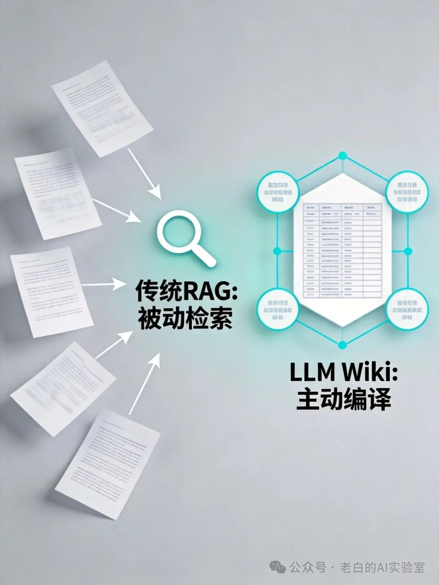
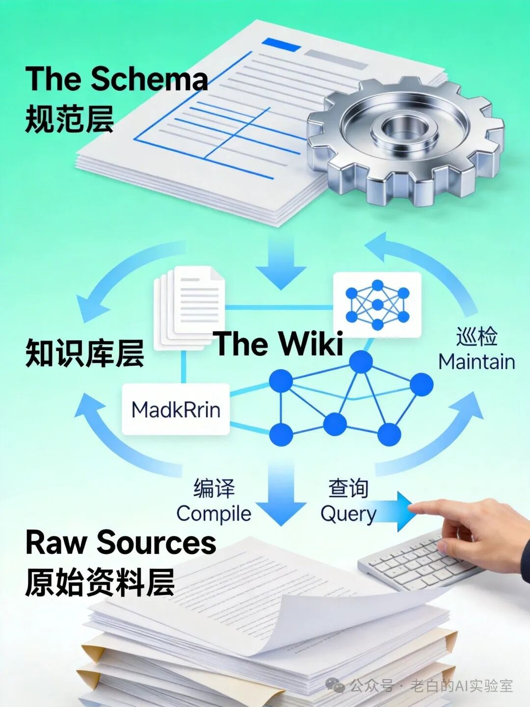
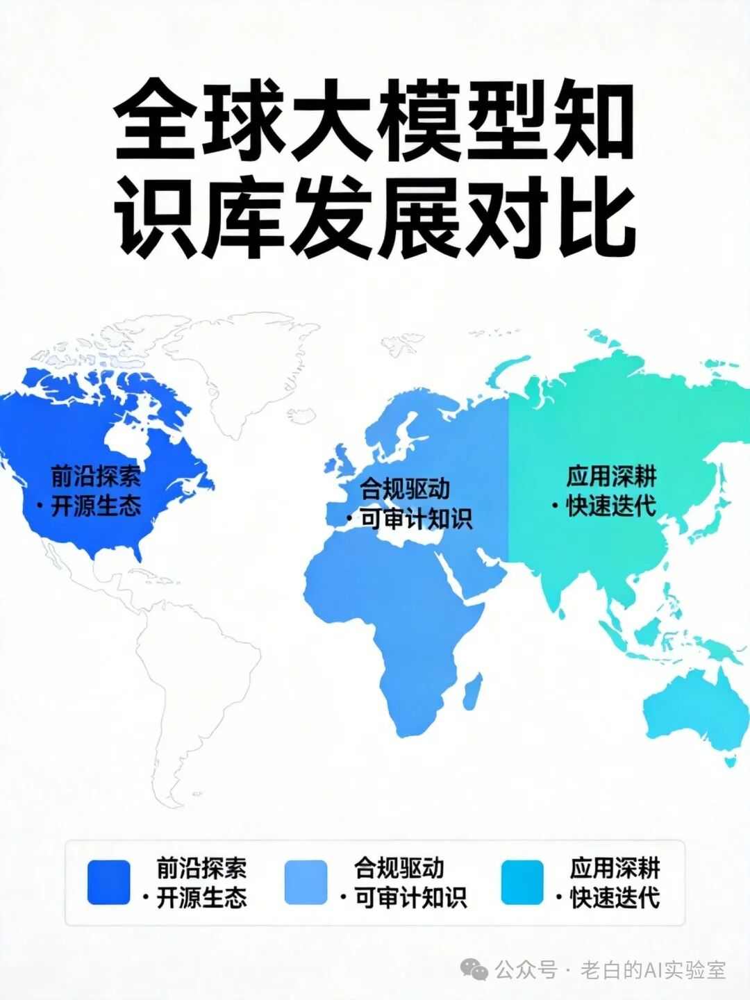

# Karpathy提出LLM Wiki：知识编译范式

> 公众号: 老白的AI实验室
> 发布时间: 2026-04-08 08:03
> 原文链接: https://mp.weixin.qq.com/s/u0psQ8wrAE5Uvt5y_sXMNA

---

📋 摘要

本文系统性探讨了"LLM Wiki"这一新兴**知识管理范式**，其标志着知识处理从**被动检索**向**主动编译**的根本性转变。

**关键词：**LLM Wiki · 知识编译 · RAG · 个人知识管理 · 人机协同

01.

## 引言：知识管理的范式之争

随着大型语言模型（LLMs）能力的飞速发展，如何使其与人类既有的、不断增长的知识体系进行高效、可信的交互，已成为**人工智能**与**知识工程**领域的核心议题。

传统基于向量数据库的**检索增强生成（RAG）**技术，在一定程度上缓解了LLM的幻觉与知识滞后问题，但其"每次查询，实时检索"的模式，本质上是将LLM作为计算器，而非知识的管理者与进化者。

2026年初提出的"LLM Wiki"构想，为解决上述困境提供了一种范式性的新思路。其核心在于，将LLM的角色从临时的"信息检索员"转变为常驻的"知识库管理员"，其任务是主动阅读、理解原始资料，并将其"编译"成结构化的、相互链接的、以Markdown格式存储的**维基知识库**。

02.

## 综述：技术演进脉络

### 2.1 从RAG到知识增强

RAG技术自提出以来，经历了从简单流水线到复杂智能体的演进：

- **Naive RAG：检索与生成简单串联，但面临检索精度与上下文窗口的限制**
- **Advanced RAG：通过查询重写、句子窗口等技术优化检索质量**
- **Agentic RAG****：****引入智能体概念，显著提升处理复杂任务的水平**

### 2.2 个人知识管理的AI原生演进

在AI时代之前，个人知识管理工具如Obsidian、Logseq等已通过**双向链接**、图谱视图等特性，体现了"知识互联"的思想。LLM Wiki的构想，正是将AI的语义理解能力与PKM工具的结构化理念相结合的产物。

图1：知识管理工具的AI原生演进

03.

## 核心架构：三层设计与知识编译

### 3.1 三层架构设计

LLM Wiki的设计精髓在于其清晰、解耦的三层架构：

### 📥 原始资料层

PDF、网页、代码、图片等原始文档

### 🧠 知识库层

Markdown维基，由LLM自动创建和维护

### ⚙️ 模式/规范层

定义知识库的"宪法"与编译规则

### 3.2 "知识编译"工作流

知识编译是LLM Wiki区别于RAG的关键操作，它是一个循环迭代的过程：

1.注入与初始化：新资料触发编译，创建或更新Wiki页面

2.查询与回答：LLM直接读取Wiki进行回答，知识可"反哺"回Wiki

3.巡检与维护：定期检测矛盾、过期信息和缺失链接

图2：LLM Wiki三层架构与知识编译工作流

💡 核心优势

**知识复利**：一次编译，多次复用 | **显式可解释**：Markdown存储，人类可直接审计 | **数据主权**：本地运行，数据完全可控

04.

## 应用挑战与限制

尽管前景广阔，LLM Wiki范式在迈向广泛应用前仍需克服一系列挑战：

**可扩展性**：处理海量、高动态性文档需要可观的算力成本

**知识一致性**：LLM幻觉可能污染知识库，需建立验证与纠错机制

**评估体系**：缺乏系统化基准测试，需涵盖结构化程度、链接密度等维度

**人机协作**：需设计直观界面让用户设定Schema、审查结果

**安全隐私**：编译过程中可能暴露敏感信息，需实现差分隐私

05.

## 全球发展比较：三大区域路径

### 🇺🇸 北美

强调前沿探索、开源精神与工程化创新，理念分享驱动社区协作

### 🇪🇺 欧洲

合规驱动与以人为本，强调可解释性、数据治理和人类监督

### 🌏 亚太

应用场景深耕与垂直整合，极致追求用户体验和实用性

三种路径并非互斥，而是互补。北美提供原始创新，欧洲强调治理框架，亚太验证应用可能。未来的发展将是多种理念的融合。

图3：全球LLM Wiki发展区域对比

06.

## 未来展望：技术融合与新范式

### 6.1 与前沿技术深度融合

- **智能体深度集成**：成为Agent的长期记忆核心和知识储备库
- **多模态知识编译**：支持图像、音频、视频等统一处理
- **分布式协同知识库**：隐私保护下的安全知识交换

### 6.2 成为新型人机接口

从更宏观的视角看，LLM Wiki所倡导的"**Markdown作为人机共识层**"的理念可能具有深远影响。Markdown这类人类可写、机器可读的格式，可能演变为未来人机协同的"通用语义协议"。

这标志着人机关系从"工具使用"向"**认知伙伴**"演进的关键一步。

**结论：**LLM Wiki代表了一种从"信息检索"到"知识编译"的范式转变。最强大的人工智能，或许是那个能帮助我们更好地整理和传承自身文明知识的伙伴。

### 📖 术语表

**LLM Wiki**：由LLM自动创建和维护的结构化个人知识库范式

**知识编译**：LLM主动阅读原始资料并更新到结构化知识库的过程

**RAG**：检索增强生成，将外部检索与LLM生成相结合

**Schema**：定义知识库组织结构和编译规则的配置文件

