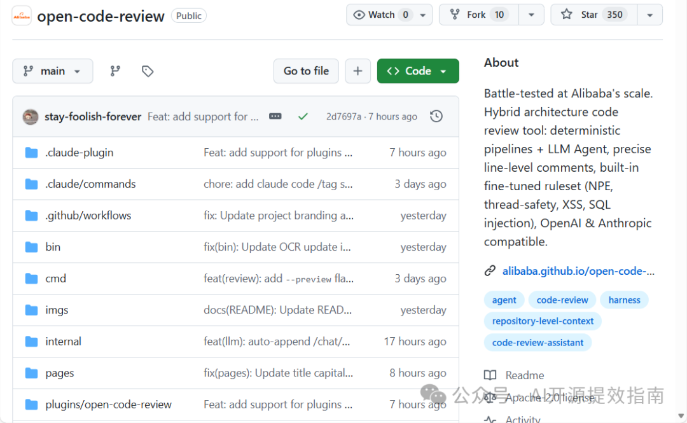
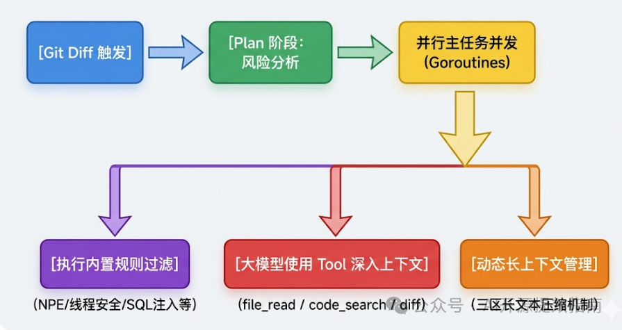
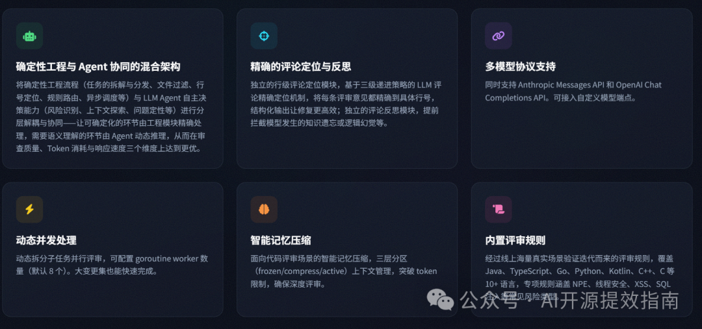
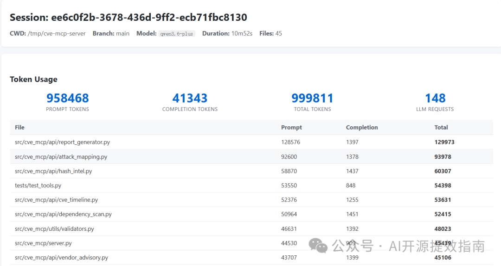
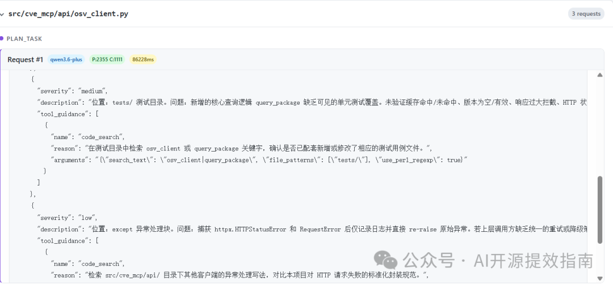
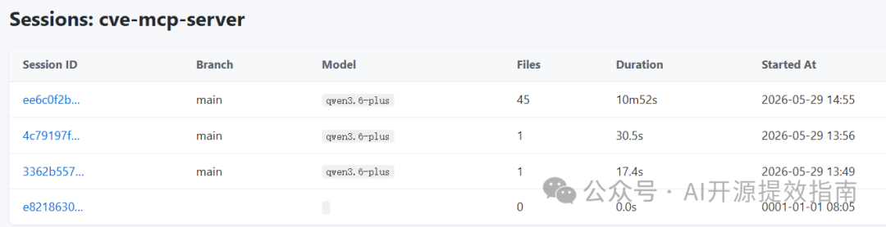

# OpenCodeReview: 阿里开源硬核代码审查工具, 确定性规则 + LLM Agent 精准到行的代码质检！

> 公众号: AI开源提效指南
> 发布时间: 2026-05-29 17:52:10
> 原文链接: https://mp.weixin.qq.com/s/TAug9CczSYdxS0d-jD7kIQ

---


大家好！这里是`AI开源提效指南`！

在研发流程中，Code Review 是保障代码质量、防止线上故障的关键步骤，但是人工评审谁都不愿意干，真的是要耗费大量精力。

即便组长或者技术负责人能抽出时间来做 CR，还容易因疲劳漏掉一些隐蔽的逻辑漏洞（如 NPE、线程安全问题）。

最近阿里巴巴开源了一款已经在其内部生产验证的硬核工具：open-code-review。原理是：读取 Git diff，配合LLM，搜索代码库、检查其他变更文件以获取上下文，从而进行深度审查，能实现精准到行级别的深度代码分析！



## 🏗️ 架构设计

`open-code-review` 的本质是一个**混合架构**。

它外层由 Go 语言编写的确定性流水线进行精确调度，内层则将大模型包装为具备 工具调用能力的自适应 Agent。



确定性管线保证了已知漏洞类型（NPE、SQL 注入等）**必被发现**，不走概率路线。

**LLM Agent**则处理需要深度理解的场景，比如"这个方法的设计是否合理"、"有没有更好的架构选择"。

## 核心功能



### 一、精准行级注释

不像某些工具只在 PR 层面给一堆模糊建议，open-code-review 会直接在**具体的代码行**上标注问题：

```
─── src/cve_mcp/api/shodan_client.py:55-60 ───
当前异常处理逻辑在捕获错误后直接 `raise` 向上抛出。作为 MCP 服务的一个情报查询工具，直接抛出未捕获的异常可能导致整个工具调用中断并返回内部错误。参考项目中 `ip_intel.py`
的容错设计，建议捕获异常并返回包含错误信息的字典，以保证服务的鲁棒性并让调用方能优雅处理失败情况。

      except httpx.HTTPStatusError as exc:
          logger.error("Shodan error for %s: HTTP %d", ip, exc.response.status_code)
-         raise
+         return {"error": f"Shodan API error (HTTP {exc.response.status_code})"}
      except Exception as exc:
          logger.error("Shodan error for %s: %s", ip, exc)
-         raise
+         return {"error": f"Shodan lookup failed: {exc}"}
```

### 二、内置 fine-tuned 审查规则库

项目内置了经过阿里大规模生产环境验证的审查规则，覆盖主流语言和框架：

| 文件类型 | 审查重点 |
| --- | --- |
| `*.java` | 空指针风险、死循环、switch fallthrough、N+1 查询、线程安全 |
| `*.{ts,js,tsx,jsx}` | 代码质量、React 最佳实践、异步规范、XSS/安全防护 |
| `*.kt` | 空安全、协程使用、惯用写法 |
| `*.{go,py,ets,lua,dart,swift,groovy}` | 逻辑 bug、拼写错误 |
| `*.{cpp,cc,hpp}` | 智能指针、RAII、STL 使用、const 正确性 |
| `*.c` | malloc/free 配对、缓冲区溢出 |
| `pom.xml` / `build.gradle` | 防止 SNAPSHOT 版本泄漏 |
| `package.json` | 最新版本/通配符版本、依赖冲突 |
| `*mapper*.xml` / `*dao*.xml` | SQL 注入、性能问题、逻辑错误 |
| `*.properties` | 拼写检测、重复 key、安全问题 |

### 三、四层规则优先级

规则匹配遵循**四层优先级链**，首匹配即生效：

1. **--rule 参数**（最高优先级）：用户指定规则文件
2. **项目配置**`<repoDir>/.opencodereview/rule.json`：可提交到 Git 的团队规则
3. **全局配置**`~/.opencodereview/rule.json`：个人偏好
4. **系统默认**`system_rules.json`：内置规则兜底

自定义规则示例：

```
{
  "rules": [
    {
      "path": "force-api/**/*.java",
      "rule": "所有新增方法必须对必填参数进行 null 校验"
    },
    {
      "path": "**/*mapper*.xml",
      "rule": "检查 SQL 是否存在注入风险、参数错误和缺失闭合标签"
    }
  ]
}
```

### 四、LLM Agent 工具链

审查 Agent 拥有以下工具能力，可以做**跨文件的上下文感知审查**：

| 工具 | 用途 |
| --- | --- |
| `file_read` | 读取指定行范围的文件内容 |
| `code_search` | 在整个代码库中搜索文本/正则 |
| `code_comment` | 提交行级审查注释 |
| `file_find` | 按文件名关键词查找文件 |
| `file_read_diff` | 查看其他变更文件的 diff 内容 |

这意味着 Agent 不只是看当前文件的 diff，它会**主动搜索关联代码、读取相关文件**，做出更全面的判断。

### 五、三阶段审查流程

```
Phase 1: Plan（规划阶段）
  └─ 变更 > 50 行时，先做风险分析
  └─ < 50 行直接进入主审查

Phase 2: Main Task（主审查循环）
  └─ 每个变更文件独立 goroutine 处理
  └─ LLM 通过工具调用进行多轮对话
  └─ 直到调用 task_done 结束

Phase 3: Memory Compression（记忆压缩）
  └─ 上下文超限时自动压缩
  └─ 三区划分：冻结区 / 压缩区 / 活跃区
```

### 6️⃣ 并发处理

- 默认 **8 个并发 worker** 并行审查文件
- 单文件超时保护（默认 10 分钟），防止某个文件卡住整个流程
- 可通过 `--concurrency` 参数调整

## 🚀 快速上手

### 安装方式

**方式一：npm 安装（推荐）**

```
npm install -g @alibaba-group/open-code-review
```

安装后全局可用 `ocr` 命令。

**方式二：下载二进制**

目前支持 Linux 与 macOS (包含 Intel 与 M 系列芯片)，直接去 `https://github.com/alibaba/open-code-review/releases` 下载对应文件即可.

**方式三：源码编译**

```
git clone https://github.com/alibaba/open-code-review.git
cd open-code-review
make build
sudo cp dist/opencodereview /usr/local/bin/ocr
```

### 配置 LLM

必须先配置 LLM 才能使用审查功能：

```
# 方式 A：命令行配置
ocr config set llm.url https://api.openai.com/v1/chat/completions
ocr config set llm.auth_token sk-xxxxxxx
ocr config set llm.model gpt-4o
ocr config set llm.use_anthropic false

# 设置中文，这个官方没给示例，目前返回的都是中文内容
ocr config set language Chinese
```

同时支持 **Claude**（Anthropic Messages API）和 **OpenAI**（Chat Completions API）双协议，自动进行 URL 标准化。

测试连通性：

```
$ ocr llm test

# 正常输出类似下面命令表示成功！
Source: OCR config file
URL:    https://coding.dashscope.aliyuncs.com/apps/anthropic
Model:  qwen3.6-plus
我是由阿里巴巴开发、运行在命令行环境中的代码审查助手 open-code-review。
```

### 使用方式

进入到你要 review 的项目，选择性的执行下面命令即可！

```
# 审查工作区所有变更（暂存 + 未暂存 + 未跟踪）
ocr review

# 审查分支差异
ocr review --from main --to dev

# 审查单个提交
ocr review --commit 9daad85265c0e082c460a77f5a723cf12fc23f0a

# 预览模式（不调 LLM，只看哪些文件会被审查）
ocr review --preview

# JSON 输出 + Agent 模式（仅摘要）
ocr review --commit 9daad85265c0e082c460a77f5a723cf12fc23f0a --format json --audience agent

# 提高并发度
ocr review --from main --to dev --concurrency 4
```

**快捷别名：**

| 命令 | 别名 | 描述 |
| --- | --- | --- |
| `ocr review` | `ocr r` | 开始代码审查 |
| `ocr viewer` | `ocr v` | 启动 WebUI |


下面是我扫描 cve 开源项目的结果！


```apache
# 启动web服务，查看扫描详情
ocr viewer --addr :3000
```






## 🔭 OpenTelemetry 集成

支持 OpenTelemetry 可观测性（span、metric），默认关闭：

```
ocr config set telemetry.enabled true
ocr config set telemetry.exporter otlp
ocr config set telemetry.otlp_endpoint localhost:4317
```

设置 `telemetry.content_logging` 可导出 LLM 的 prompt 和 response。

## 📊 与其他工具对比

| 特性 | open-code-review | GitHub Copilot Review | ReviewDog |
| --- | --- | --- | --- |
| 确定性规则 | ✅ | ❌ | ✅ |
| LLM Agent 工具调用 | ✅ | ❌ | ❌ |
| 跨文件上下文感知 | ✅ | ⚠️ 有限 | ❌ |
| 精准行级注释 | ✅ | ✅ | ✅ |
| 多模型支持 | ✅ | ❌ | ❌ |
| 本地 CLI | ✅ | ❌ | ✅ |
| CI/CD 集成 | ✅ | ✅ | ✅ |
| 开源 | ✅ | ❌ | ✅ |

## 总结

通过自己的测试，总的来说，open-code-review 是目前**最接近"AI + 规则双保险"理念**的开源代码审查工具。

**适合人群：**

- ✅ 有代码审查流程的工程团队，希望提升审查效率
- ✅ 使用 Java/TypeScript/Go/Python 等多语言项目的团队
- ✅ 需要在 CI/CD pipeline 中集成自动化审查的团队
- ✅ 关注 NPE、SQL 注入、线程安全等常见 bug 的团队

如果你受够了传统 AI 审查工具的"泛泛而谈"，想要一个既懂规则又懂上下文的代码审查助手，open-code-review 值得一试。

## 📖 **参考资源**

```
GitHub 仓库: https://github.com/alibaba/open-code-review
官方文档: https://alibaba.github.io/open-code-review/
```

免责声明：本文内容仅供学习交流，所述工具/方法请遵守相关平台服务条款及法律法规。如涉及第三方服务，请以官方最新政策为准。

---

**🎯****觉得这份工具干货有用？希望收到您的支持：**

- ⭐ 星标 / 置顶公众号，**第一时间解锁最新工具分享！**
- ✅ **点赞**「**推荐**」，让更多技术伙伴发现优质干货！
- 🔗 **转发**给团队小伙伴，一起高效提效！
- 💬 **底部留言区**，告诉我您想找的工具/项目方向！

**📬 长期追踪优质开源工具**

- 关注「**AI 开源提效指南**」｜日更开源神器，玩转技术提效！
- 回复 **【容器加速器】**，即刻开启你的高效探索之旅～
