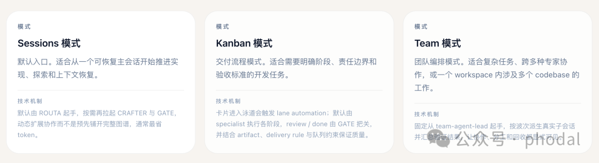
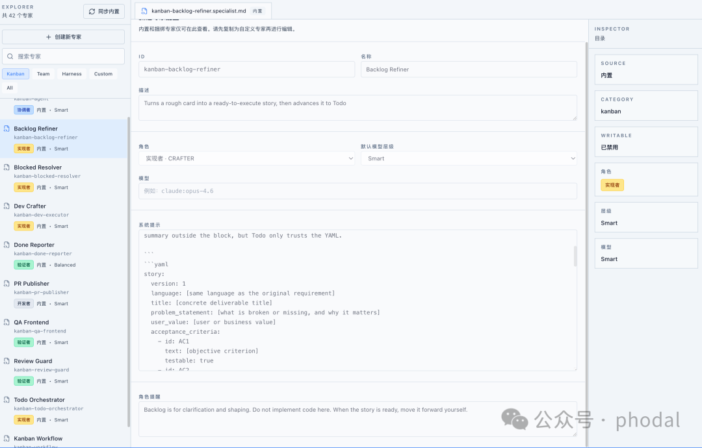
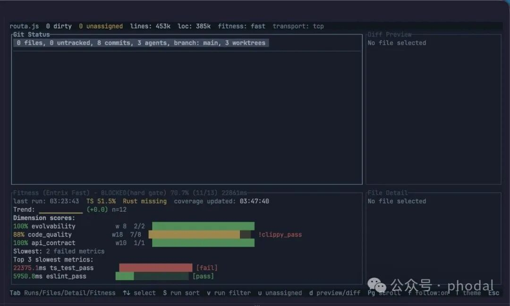
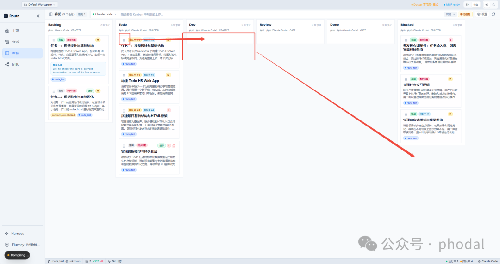
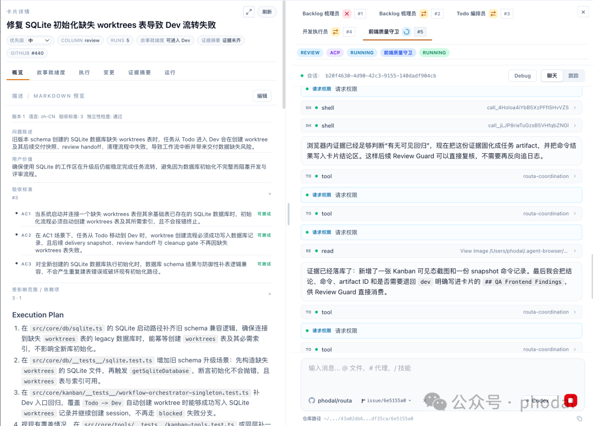
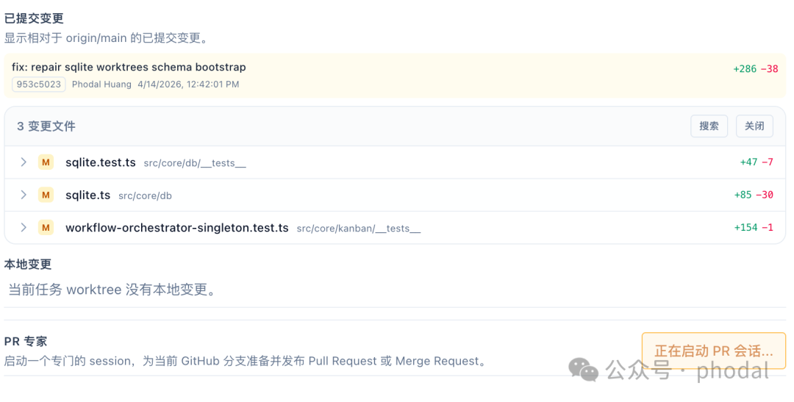
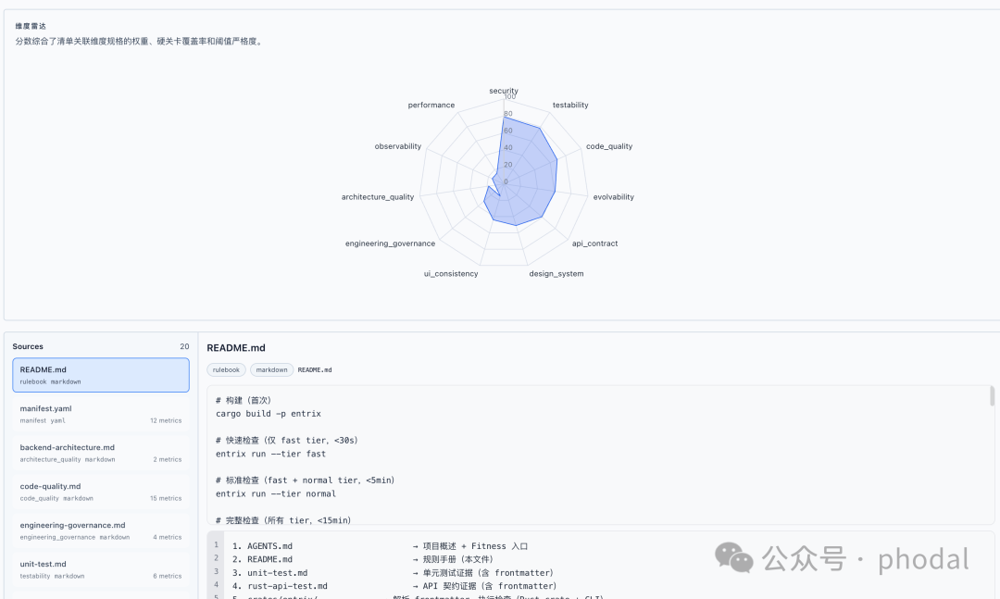
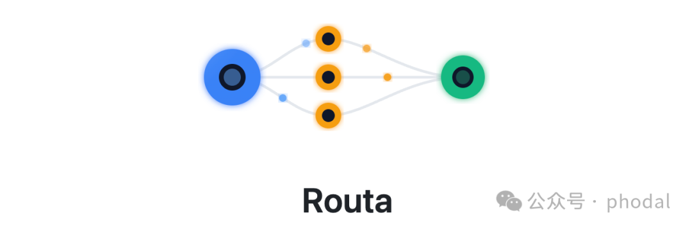

# Routa 桌面版发布：内建 Harness 工程的 AI Coding 研发协作工作台

> 公众号: phodal
> 发布时间: 2026-04-14 15:51:34
> 原文链接: https://mp.weixin.qq.com/s/z-rQ19_1qD2Dq9gTm-re5w

---

TL;DR：下载地址：https://github.com/phodal/routa/releases （由于  Apple 证书原因，macOS 下载 x64 版本）

几个月前，当 Coding Agent 的 CLI 模式开始显著改写整个行业时，我一边做出了《[AutoDev CLI](https://mp.weixin.qq.com/s?__biz=MjM5Mjg4NDMwMA==&mid=2652980045&idx=1&sn=2308877e3c258b98af01d32a48ac2334&scene=21#wechat_redirect)》， 一边也逐渐意识到：这场变化真正重要的，并不只是把 Coding Agent 搬进命令行。

随着对 ACP 协议和多 Agent 协同的持续实践，我越来越确认一件事：**单个 Coding Agent 已经不再是最关键的问题，真正重要的，是如何让多个 Agent 在同一套工程体系里协同工作。** 从《[Vibe Coding 何必只在桌面 IDE，编码智能体协同的思考与设计](https://mp.weixin.qq.com/s?__biz=MjM5Mjg4NDMwMA==&mid=2652980040&idx=1&sn=893822ca988c9244eeef8fe574ba2f10&scene=21#wechat_redirect)》到 《[2026 年，万物皆 Coding Agent 的平台工程](https://mp.weixin.qq.com/s?__biz=MjM5Mjg4NDMwMA==&mid=2652980238&idx=1&sn=de605192d27d443d03f582d5ed507d9a&scene=21#wechat_redirect)》， 我其实一直在追问同一个问题：当 Dev 逐步退居为 AI Coding 流程中的一个环节之后，我们是否需要重新定义研发协作的平台形态？

顺着这条脉络，我做了一系列多 Agent 实验。直到后来，我逐渐形成了基于 Harness 工程的体系化思考，才忽然意识到：我一直在寻找的，也许正是这样一个答案——

> Harness 工程 + Coding Agent + Kanban = AI 自动化研发工作台

Routa，就是这个公式第一次比较完整地落到产品形态上。

## 引子 1：从 Agent Team 到 Kanban，难点其实是 DoD

早先，我们探索的是多 Agent 的任务协同。 《[Agent Team 实践与架构设计：在约束下构建可演进的一个人开发团队](https://mp.weixin.qq.com/s?__biz=MjM5Mjg4NDMwMA==&mid=2652980225&idx=1&sn=d018265432b1fa42bf08e2a1961fbfbf&scene=21#wechat_redirect)》里， 我关心的是：一个人带多个 Agent 时，怎么拆角色、控边界、做交接。

到了现在的 Kanban 方式，再到现在的基于看板的方式，我们进行了一系列的尝试和探索。其中最难的一点是：

> DoD（Definition of Done，完成的定义）到底是什么？

在人工看守的本地模式和远程 Agent 自动化模式下，完成的定义明显不一样：

- • 在基于 Spec 的模式里，DoD 定义的是**开发完成**，也就是 Spec 里的验收标准已经满足。
- • 在基于 Kanban 的模式里，DoD 定义的是**交付完成**，也就是这张卡片已经具备进入 `done` 列的条件。

简单来说，**Spec 模式里的 done，只是 Kanban 里的 Dev 完成**。从开发完成到交付完成，中间还隔着验证、门禁、证据和状态流转。

## 引子 2：Routa 自身长出来的 Harness 工程

当 Coding Agent 越来越多、模型能力持续增强时，我们真正要回答的问题就变成了：如何让这些 Agent 在同一套工程约束下工作，而不把系统推向熵增？一个最简单的方式，就是为 Routa 项目构建 Harness 工程。通过实践与反复提炼框架，我们就能得到一个可以在其他项目中复用的 Harness 工程框架。于是，围绕 Routa，我逐步长出了几组关键部件。

- • [Entrix](https://mp.weixin.qq.com/s?__biz=MjM5Mjg4NDMwMA==&mid=2652980357&idx=1&sn=96ab04cc1264079cb5751e27c288d8d2&scene=21#wechat_redirect) (https://github.com/phodal/entrix) （[Entrix 开源了：我们如何用反熵机制治理 Vibe Coding](https://mp.weixin.qq.com/s?__biz=MjM5Mjg4NDMwMA==&mid=2652980331&idx=1&sn=8a3877e5587a816e648a0765331f92df&scene=21#wechat_redirect)）负责把质量规则、架构约束和验证步骤转化为可执行的防护措施；
- • [Harness Monitor](https://mp.weixin.qq.com/s?__biz=MjM5Mjg4NDMwMA==&mid=2652980449&idx=1&sn=0292829ac04841867df6362802966e9b&scene=21#wechat_redirect)（[Harness Monitor：当多个 Agent 同时写代码时，如何看住质量](https://mp.weixin.qq.com/s?__biz=MjM5Mjg4NDMwMA==&mid=2652980449&idx=1&sn=0292829ac04841867df6362802966e9b&scene=21#wechat_redirect)）负责在多个 Agent 同时作用于一个代码库时，持续观察质量和变化；
- • [Harness Dashboard](https://mp.weixin.qq.com/s?__biz=MjM5Mjg4NDMwMA==&mid=2652980387&idx=1&sn=9fab47a7476b3b9781d535d9e9f8f5c0&scene=21#wechat_redirect)（《[Harness 工程可视化：在 Vibe Coding 中重建工程可控性](https://mp.weixin.qq.com/s?__biz=MjM5Mjg4NDMwMA==&mid=2652980387&idx=1&sn=9fab47a7476b3b9781d535d9e9f8f5c0&scene=21#wechat_redirect)》）用来把这些信号可视化地展示出来；
- • Routa Kanban 则进一步把需求、状态、交接与门禁放进同一条任务流里。

现在 Routa 已经有接近 50 万行代码，并且几乎 100% 由 AI 生成。

而在整个系统里，最能体现 Harness 工程思路的，是 Routa Kanban 本身。它既是任务板，也是给 Agent 分派工作的界面；但更重要的是，它还是一套内建了质量门禁、阶段约束和领域专家的任务状态机： 卡片进入哪一列，不只是状态变化，也意味着系统开始按另一组规则检查这项工作是否具备继续推进的条件。

真实的软件研发从来不是一连串彼此独立的局部胜利。它更像一条持续推进的流：需求进入系统，任务被拆开，阶段向前滚动，不同角色在不同位置接手， 结果被验证、退回、重试，最后只有一部分穿过门禁进入交付。会话能承载一次生成，很难承载一条长期存在的任务流。

## Harness 前置：Kanban 作为任务协议

一旦 DoD 从“开发完成”变成“交付完成”，Kanban 就不再是看进度的工具了。它开始变成一套任务级的协议：卡片往哪一列走，不是位置变化，而是状态切换；

 状态一变，输入、输出、验证方式以及后续动作都会被重新定义： `backlog`、 `todo`、 `dev`、 `review`、 `done`、 `blocked`，这些列，不只是流程节点， 而是不同阶段的工程语义，也是 specialist 接力协作的边界。

在 Routa 的 Kanban workflow 里，一张卡本质上是一个被持续补全的协议对象。

- • 进入 backlog，系统要求的是一份能被机器读取的 YAML，里面要有问题陈述、验收标准、影响范围、依赖关系和 INVEST 检查；
- • 进入 todo，要求会变成执行计划、关键文件、依赖计划和风险说明；
- • 进入 dev，要求的是 “这件事是否已经准备到可以编码”，并且实现之后必须补齐开发交付物；
- • 进入 review，系统关心的“证据是否完整、验证是否独立、范围是否失控”；
- • 到了 done，判断重点是“这张卡是否已经带着 APPROVED 的评审结果被交付系统正式接纳”。

在这里 Kanban 是一套协议，列与列之间不是视觉上的排队关系，而是**准入门禁**和**准出门禁**的切换关系。 每个下游阶段先验证上游有没有交出它该交的东西，不合格就退回去： `todo` 可以把不完整的 story 打回 `backlog`， `dev` 可以把不可执行的卡退回 `todo`， `review` 也会因为证据不足、测试缺失、范围蔓延而把卡退回 `dev`。

所以，我更愿意把 Routa 的 Kanban 看成 Harness 的任务界面，它把“完成”这件事从口头判断变成系统约束。

## 多 Agent 协作：沿着泳道接力

协议写清楚之后，接下来的问题就简单多了：谁来履行协议，谁来接下一棒。

多 Agent 最容易被误解成一个并行问题：好像只要同时开更多 Agent，系统自然就会更强。可工程现实往往正好相反。Agent 越多，如果职责边界不清、阶段责任不明、交接关系含糊，系统只会更快地产生噪音。表面上每个 Agent 都在工作，实际上没有谁真正对某个环节负责。

所以在 Routa 里，多 Agent 的重点从来不是 “更多”，而是在于如何 “更清楚”。在这里真正参与交接的是 Kanban workflow 里的各个 Lane specialist（泳道专家）：

- • Backlog Refiner（ backlog-refiner）：负责把粗糙卡片压成可执行 story，补齐 canonical YAML、验收标准（AC）、依赖与 INVEST 判断，然后推进到 todo。
- • Todo Orchestrator（ todo-orchestrator）：负责校验 backlog 产物，并补齐执行计划、关键文件、依赖计划和风险说明。
- • Dev Crafter（ dev-executor）：负责实现、提交代码、补齐开发证据（Dev Evidence），再送入 review。
- • QA Frontend（ qa-frontend）：在涉及界面时补充前端验证证据，为评审提供视觉回归与截图依据。
- • Review Guard（ review-guard）：最终质量门禁，独立验证 AC、测试、Git 状态、范围控制和 Entrix 预算，不合格就退回 dev。
- • Blocked Resolver（ blocked-resolver）：处理阻塞与恢复路径，把不清晰需求、环境依赖和执行问题重新路由到合适阶段。
- • Done Reporter（ done-reporter）：在通过评审后补充完成总结； PR Publisher（ pr-publisher）负责整理分支并发起 PR/MR，属于交付侧 specialist，不在基础看板流转内。

这套设计最关键的是：“只做自己这一列该做的事”。每一个 specialist 都先验证上游，再完成本列目标，最后通过 `move_card` 把责任显式交给下游。

多 Agent 需要的就是：一条带有门禁、回退和恢复机制的接力链。

## 重新定义 done：系统何时放行，何时拒绝

状态流和职责流一旦都成立，就会回到文章一开始的眼前：**done 到底是什么？**

对于一个长周期的项目来说，Done 通常要意味着两件事：

- • 技术 done。交付的代码已经通过了所有质量门禁，可以被合并到主干。
- • 业务 done。交付的代码已经包含了所有验收标准，可以被发布到生产环境。

对于一个会持续被 AI Agent 改写的代码库来说，团队需要用软件工程的方式，重新回答“什么样的系统还能继续演进”。至少要把下面这些问题提前想清楚：

- • 架构测试。哪些模块边界不能被打穿，哪些改动一旦越界，就应该被系统直接拦下。
- • 契约稳定性。哪些接口、数据结构和领域契约必须保持稳定，不能随着一次局部实现被随意改写。
- • 质量门禁。哪些验证在进入主干之前必须完成，哪些测试、检查和证据不能省略。
- • 回归控制。哪些回归风险需要在合并之前被识别出来，不能留到发布之后再补救。
- • Agent 可理解性。如何通过渐进式披露能让 Agent 持续读懂、定位和修改。
- • ……

到了这里，Harness 就已经进入了完成定义本身。它把架构 Fitness、门禁规则、证据要求和放行条件前置下来，让系统能够判断：这次结果应该继续往前走，还是应该停在这里。

## 总结：为什么 Routa 更像一套研发协作工作台

回到最开始那个公式：

> Harness 工程 + Coding Agent + Kanban = AI 自动化研发工作台

其中，Coding Agent 提供的是执行能力，Kanban 提供的是任务状态，Harness 工程提供的则是约束、验证和完成定义。只有这三者被放进同一套系统里，AI Coding 才不会停留在“更快生成代码”的阶段，而开始进入“如何组织协作、如何定义完成、如何接住交付”的问题域。

所以，Routa 想做的，并不是一个聊天式 Coding Agent，也不只是一个多 Agent 容器。它在尝试做的，是把任务流、职责流和证据流重新接到一起，把“完成”重新写回系统。

