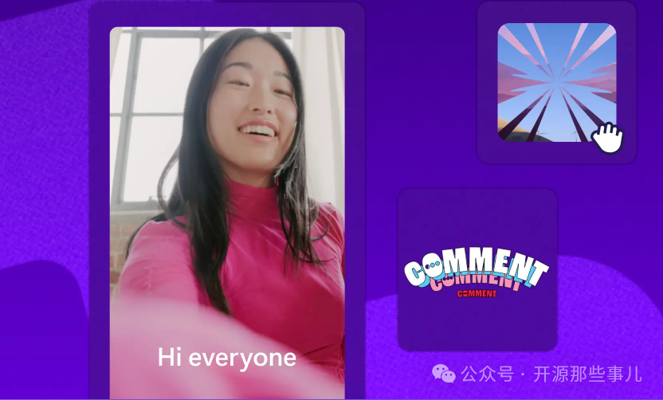

# 【开源】一个人就是一家视频工厂：告别剪映！这款开源神器，自动生成语音+字幕+背景视频，还带 REST API 和 MCP

> 公众号: 开源那些事儿
> 发布时间: 2026-03-27 11:30
> 原文链接: https://mp.weixin.qq.com/s/tFTZCwAe-Z1FPK7Uanr88g

---
最近在折腾 AI 短视频时，发现了一个非常“硬核”的开源项目：short-video-maker。简单来说，它能帮你实现：
> 输入一段文字 → 自动生成配音、字幕、背景视频和音乐 → 输出一条完整的短视频。

更厉害的是，它不仅提供网页界面，还开放了REST API和MCP 接口，可以轻松集成到你的自动化工作流中，比如 n8n、AI 智能体等。如果你也想批量制作 YouTube Shorts、短视频博客或产品宣传片，这个项目绝对值得一试。

---

🤔 项目由来：给 AI 视频“降本增效”这个项目本质上是一个自动短视频生成服务。你提供文本和搜索关键词，它就能利用开源模型，自动生成一条包含语音、字幕、背景视频和音乐的短视频。项目的目标是提供一个免费的替代方案，以替代那些依赖昂贵 GPU 或第三方 API 的视频生成工具。它并非从零生成视频，而是巧妙地组合现有资源：

- 语音：使用 Kokoro TTS 将文本转为语音。
- 字幕：通过 Whisper 自动识别语音并生成时间轴。
- 画面：从 Pexels 获取无版权的背景视频。
- 合成：利用 Remotion 将以上所有元素渲染成最终视频。

这种“组装式”的思路，使得项目对硬件要求相对友好，普通服务器甚至家用电脑就能跑起来。

---

⚙️ 工作原理：一条文本的自动化旅程你只需提供一个包含多个“场景”的 JSON 配置，每个场景包含文本和搜索关键词。工具会按以下步骤自动处理：

- 文本转语音 (TTS)：调用 Kokoro TTS，根据你选择的语音风格（如 af\_heart）生成音频文件。
- 语音识别 (ASR)：使用 Whisper 模型将音频精准转写为带时间戳的文字，作为字幕的基础。
- 获取背景视频：根据每个场景的搜索词，从 Pexels API 获取相关视频片段。如果找不到，则使用 nature、ocean等默认关键词。
- 合成视频：Remotion 将音频、字幕、背景视频和背景音乐按预设模板（如 9:16 竖屏）进行排版、转场和渲染，最终输出一个完整的 MP4 文件。

核心特点：多场景支持：一个视频可由多个“场景”拼接而成，让内容更丰富。可配置性：支持自定义字幕位置、颜色、背景音乐风格、视频方向（横屏/竖屏）等。

---

🚀 核心功能：不止于“一键生成”1. 文本到视频全流程输入文字脚本，即可自动生成一条包含语音、字幕、背景和音乐的短视频，非常适合制作 YouTube Shorts、知识科普等内容。2. 模板化视频编辑提供可复用的视频模板，你只需替换文字、Logo 或背景音乐，即可快速生成风格统一的视频，如品牌宣传片、活动预告等。3. 视频尺寸与用途转换内置工具可将横屏视频一键转为竖屏，方便将长视频剪辑成适合抖音、快手、视频号的短视频或精彩集锦。4. AI 短片制作支持上传照片和视频，选择风格，由 AI 自动完成剪辑、配乐和字幕，快速生成社交媒体视频。5. 开发者友好 API这是其区别于普通剪辑软件的最大亮点，提供两种接口：REST API：通过 HTTP 请求（如 /api/short-video）创建和查询视频任务，易于与各种系统集成。MCP 接口：遵循模型上下文协议，可作为“工具”被 n8n、AI 智能体等调用，实现全自动化的视频生产流水线。

---

👍 项目优点

- 开源免费：可本地部署，无平台抽成，数据隐私有保障。
- 成本友好：主要消耗算力与 API 调用（Pexels 有免费额度），无需昂贵的 GPU 集群。
- 高度自动化：从文本输入到成片输出，全程无需人工剪辑，极大提升效率。
- 开发者生态：提供 REST 和 MCP 接口，易于集成到自动化工作流中，潜力巨大。
- 版权清晰：默认使用 Pexels 的无版权素材，降低了内容创作的法律风险。

---

⚠️ 局限与注意点

- 语言限制：目前仅支持英语配音，Kokoro TTS 暂不支持中文。
- 素材依赖：背景视频来源于 Pexels，需遵守其 API 使用条款，且内容风格受限于素材库。
- 平台支持：官方 Web UI 主要配合 Docker 在 Linux/macOS 上运行，Windows 支持有限。
- 非“文生视频”：它不生成全新的画面，而是通过“组合”现有素材来创作，更像是一个高级的自动化剪辑工具。

---

🆚 同类工具对比

---

🎯 适用人群

- 内容创作者：希望将博客、文章等内容快速转化为视频。
- YouTuber：需要高效制作 Shorts 或剪辑频道预告。
- 电商/营销团队：用于批量生成产品介绍和广告视频。
- 开发者/技术团队：希望将视频生成能力集成到自己的系统或自动化流程中。

总而言之，如果你受够了手动剪辑的繁琐，又不满足于简单的模板化工具，那么short-video-maker是一个值得深入研究的开源项目。

开源地址


```javascript
https://gitcode.com/gh_mirrors/sh/short-video-maker
```


[7元解锁710+AI与开源项目资料，每周更新，包括90+低开平台，90+AI平台，5400+ skills，40+ AI教程](https://mp.weixin.qq.com/s?__biz=MzUyNDgyNTg2Ng==&mid=2247492144&idx=1&sn=8e699f56ad4999add180b3336a675d16&scene=21#wechat_redirect)