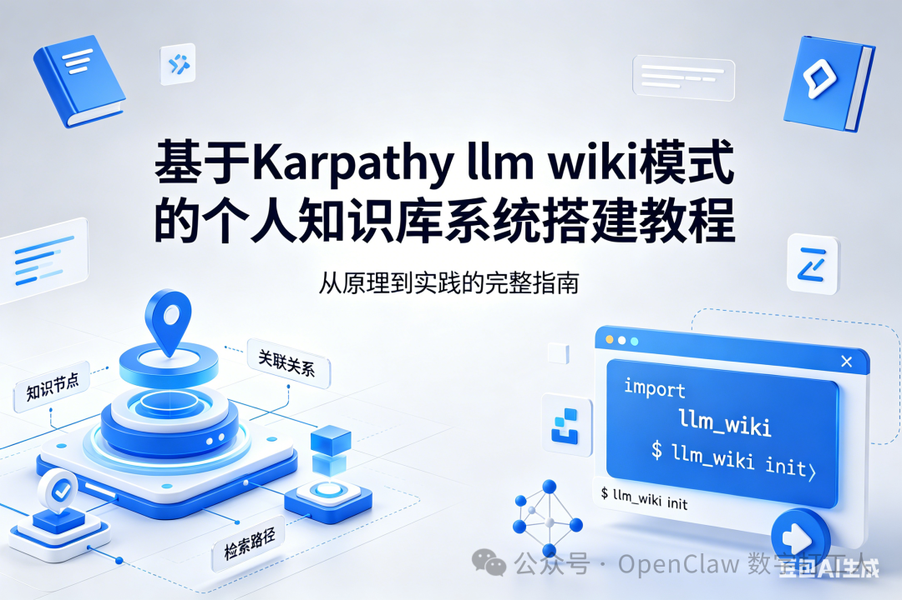

# 基于Karpathy llm wiki模式的个人知识库系统搭建教程！

> 公众号: OpenClaw 数字打工人
> 发布时间: 2026-04-22 08:51:36
> 原文链接: https://mp.weixin.qq.com/s/c_O8NBiYa2HgBO8Tnlaj0A

---


最近，OpenAI 科学家 Andrej Karpathy 分享了一种全新的「LLM Wiki」个人知识管理模式，引发了社区广泛讨论。这种模式结合了大语言模型的能力和传统维基百科的结构化组织方式，让你可以快速构建一个属于自己的可交互知识库。

今天我们就从零开始，一步步教你搭建一套属于自己的基于 Karpathy LLM Wiki 模式的个人知识库系统。

## 什么是 Karpathy LLM Wiki 模式？

在开始搭建之前，我们先来理解一下什么是 LLM Wiki 模式。

Andrej Karpathy 在 Twitter 上分享了他自己使用的知识管理方法：

> 我现在用一种"LLM Wiki"的方式管理我的笔记：
>
> 1. 1. 所有笔记都是纯 Markdown 文件，存在本地 Git 仓库
> 2. 2. 使用语义搜索找到相关笔记
> 3. 3. 让 LLM 基于相关笔记内容回答你的问题
> 4. 4. 你可以随时让 LLM 总结更新笔记

这种模式的核心思想非常简单：

- • **本地存储**：所有知识以纯 Markdown 文件保存在本地，不依赖特定服务
- • **语义检索**：通过向量搜索找到和问题相关的知识片段
- • **LLM 问答**：让大模型基于检索到的知识回答问题，减少幻觉
- • **迭代进化**：随着你不断添加新笔记，知识库会越来越强大

和传统的 Notion、Obsidian 等笔记软件相比，Karpathy 模式更加轻量化，也更能发挥大语言模型的优势。

## 方案选型：我们要搭建什么？

Karpathy 只是分享了思路，并没有给出具体实现。今天我们选择一个开箱即用的方案，用到这些工具：

| 组件 | 作用 | 选型 |
| --- | --- | --- |
| 文档存储 | 保存 Markdown 笔记 | 本地文件系统 + Git |
| 向量嵌入 | 将文本转为向量 | OpenAI Embeddings / 本地开源模型 |
| 向量数据库 | 存储和检索向量 | ChromaDB（轻量易用） |
| 大语言模型 | 生成回答 | OpenAI GPT-3.5/4 / 本地模型 |
| 前端界面 | 交互界面 | Next.js + Tailwind / 直接用 Python Streamlit |

为了让新手也能轻松搭建，我们今天选择 **Python + Streamlit + ChromaDB + OpenAI** 的组合，这个方案最简单，几分钟就能跑起来。

## 环境准备

在开始之前，你需要准备好这些环境：

### 1. 安装 Python

确保你的系统已经安装了 Python 3.9 以上版本：

```
python --version
# Python 3.10.12 或更高版本都可以
```

如果没有安装，可以去 Python 官网 下载安装。

### 2. 获取 OpenAI API Key

我们需要使用 OpenAI 的 Embeddings 和 GPT 接口：

1. 1. 访问 OpenAI Platform
2. 2. 登录你的账号
3. 3. 进入 API Keys 页面
4. 4. 创建一个新的 Secret Key
5. 5. 复制保存好这个 Key，后面会用到

> 如果你不想用 OpenAI，也可以使用本地开源嵌入模型，比如 `all-MiniLM-L6-v2`，我们后面会提到替代方案。

### 3. 创建项目目录

```
mkdir llm-wiki-demo
cd llm-wiki-demo
```

### 4. 创建虚拟环境（推荐）

```
python -m venv venv
source venv/bin/activate  # macOS/Linux
# venv\Scripts\activate  # Windows
```

## 安装依赖

安装我们需要的 Python 包：

```
pip install streamlit chromadb openai python-dotenv langchain
```

这些包的作用：

- • `streamlit`：快速搭建交互界面
- • `chromadb`：开源向量数据库，存储和检索向量
- • `openai`：OpenAI API 客户端
- • `python-dotenv`：加载环境变量
- • `langchain`：文档处理和链编排，简化开发

## 项目结构

我们先规划好项目结构：

```
llm-wiki-demo/
├── .env                # 存放 API Key
├── app.py              # 主程序
├── knowledge/          # 你的 Markdown 知识库放在这里
│   └── .gitkeep
└── requirements.txt    # 依赖列表
```

创建目录：

```
mkdir knowledge
```

## 编写代码

### 1. 配置环境变量

创建 `.env` 文件：

```
OPENAI_API_KEY=你的OpenAI API Key在这里
```

把你刚才获取的 OpenAI API Key 填进去。

### 2. 编写主程序

创建 `app.py`，这是完整代码：

```
import os
import dotenv
import streamlit as st
from langchain.document_loaders import DirectoryLoader, TextLoader
from langchain.text_splitter import RecursiveCharacterTextSplitter
from langchain.embeddings import OpenAIEmbeddings
from langchain.vectorstores import Chroma
from langchain.chat_models import ChatOpenAI
from langchain.chains import RetrievalQA

# 加载环境变量
dotenv.load_dotenv()
OPENAI_API_KEY = os.getenv("OPENAI_API_KEY")

# 页面配置
st.set_page_config(
    page_title="LLM Wiki",
    page_icon="📚",
    layout="wide"
)

def init_knowledge_base():
    """初始化知识库：加载文档，分割，创建向量索引"""
    # 加载所有 Markdown 文档
    loader = DirectoryLoader(
        "knowledge",
        glob="**/*.md",
        loader_cls=TextLoader,
        loader_kwargs={"encoding": "utf-8"}
    )
    documents = loader.load()
    st.info(f"加载了 {len(documents)} 篇文档")

    # 分割文本为小块
    text_splitter = RecursiveCharacterTextSplitter(
        chunk_size=1000,
        chunk_overlap=200,
        separators=["\n\n", "\n", " ", ""]
    )
    texts = text_splitter.split_documents(documents)
    st.info(f"分割为 {len(texts)} 个文本块")

    # 创建向量存储
    embeddings = OpenAIEmbeddings(openai_api_key=OPENAI_API_KEY)
    db = Chroma.from_documents(
        texts,
        embeddings,
        persist_directory="./chroma_db"
    )
    db.persist()
    return db

def load_knowledge_base():
    """加载已有的知识库"""
    embeddings = OpenAIEmbeddings(openai_api_key=OPENAI_API_KEY)
    db = Chroma(
        persist_directory="./chroma_db",
        embedding_function=embeddings
    )
    return db

# 主界面
st.title("📚 LLM Wiki 个人知识库")

# 侧边栏
with st.sidebar:
    st.header("知识库操作")
    if st.button("重新构建索引"):
        with st.spinner("正在构建知识库索引..."):
            db = init_knowledge_base()
        st.success("索引构建完成！")

# 尝试加载已有知识库
if os.path.exists("./chroma_db"):
    db = load_knowledge_base()
else:
    with st.spinner("首次运行，正在构建知识库..."):
        db = init_knowledge_base()

# 创建问答链
llm = ChatOpenAI(
    model_name="gpt-3.5-turbo",
    temperature=0,
    openai_api_key=OPENAI_API_KEY
)
qa_chain = RetrievalQA.from_chain_type(
    llm=llm,
    chain_type="stuff",
    retriever=db.as_retriever(search_kwargs={"k": 5}),
    return_source_documents=True
)

# 问答区域
query = st.text_input("在这里输入你的问题：")
if query:
    with st.spinner("思考中..."):
        result = qa_chain({"query": query})

    st.markdown("### 回答")
    st.write(result["result"])

    st.markdown("### 参考来源")
    for i, doc in enumerate(result["source_documents"]):
        with st.expander(f"{i+1}. {os.path.basename(doc.metadata['source'])}"):
            st.write(doc.page_content)

# 使用说明
with st.expander("📖 使用说明"):
    st.markdown("""
    1. 将你的 Markdown 笔记放入 `knowledge/` 文件夹
    2. 点击侧边栏的「重新构建索引」
    3. 在输入框提问，系统会基于你的笔记回答
    4. 回答会显示参考的来源文档，方便你查证

    **提示**：更新知识库后，一定要点击「重新构建索引」才能生效。
    """)
```

代码不算长，我来解释一下关键步骤：

1. 1. **文档加载**：使用 `DirectoryLoader` 自动加载 `knowledge/` 目录下所有 `.md` 文件
2. 2. **文本分割**：把长文档分割成小块（1000字符左右），方便嵌入和检索
3. 3. **向量生成**：使用 OpenAI Embeddings 将每个文本块转为向量
4. 4. **向量存储**：把向量存在 ChromaDB 中
5. 5. **问答检索**：用户提问时，先检索最相关的 5 个文本块
6. 6. **LLM 生成回答**：把问题和检索到的上下文一起发给 GPT，生成回答

## 添加你的知识

现在往 `knowledge/` 文件夹里放一些 Markdown 笔记试试。你可以把你现有的笔记复制进去，也可以新建几个测试文件。

举个例子，创建 `knowledge/ai-testing.md`：

```
# AI 大模型测试要点

测试大语言模型需要关注几个方面：

1. **准确性**：回答是否正确，有没有幻觉
2. **有用性**：回答是否解决了用户问题
3. **安全性**：会不会生成有害内容
4. **鲁棒性**：对模糊问题的处理能力
5. **一致性**：相同问题多次回答是否一致

不同场景的测试重点不同：
- 对话机器人侧重对话流畅性和有用性
- 问答系统侧重准确性和事实正确性
- 创意写作侧重创新性和连贯性
```

再多创建几个测试文件，内容越丰富，问答效果越好。

## 运行程序

现在启动应用：

```
streamlit run app.py
```

Streamlit 会自动打开浏览器，如果没有自动打开，访问终端输出的地址（一般是 `http://localhost:8501`）。

你应该能看到这样的界面：

- • 左侧边栏：有一个「重新构建索引」按钮
- • 中间：有一个提问输入框
- • 底部：使用说明

首次运行会自动加载文档并构建索引，稍等片刻就完成了。

## 开始使用

现在你可以提问了！比如你刚才添加了关于 AI 测试的笔记，可以问：

```
测试大语言模型需要关注哪些方面？
```

系统会：

1. 1. 在你的知识库中搜索相关内容
2. 2. 把最相关的内容上下文发给 GPT
3. 3. GPT 基于你的笔记生成回答
4. 4. 显示回答，同时列出参考的来源文档

这样，你就得到了一个完全基于你个人知识的问答系统，而且不会胡乱编造，所有回答都能找到来源。

## 使用技巧分享

### 1. 怎么组织我的笔记？

和平时写 Markdown 笔记一样就行，遵循这些建议：

- • 一篇笔记一个主题，不要太长
- • 使用标题分级（`#` `##`）帮助分割内容
- • 重要内容用加粗突出
- • 保持文件结构清晰，可以用子文件夹分类

### 2. 什么时候需要重新构建索引？

只要你添加、修改、删除了 `knowledge/` 里的文件，都需要点击「重新构建索引」更新向量数据库。

### 3. 检索不到内容怎么办？

- • 检查问题表述，换一种问法试试
- • 确认相关笔记确实存在于 `knowledge/`
- • 可以在代码里把 `search_kwargs={"k": 5}` 改成更大的数字，比如 `k=10`，返回更多相关结果

### 4. 怎么备份我的知识库？

因为所有笔记都是纯 Markdown 文件存在 `knowledge/`，你可以直接用 Git 做版本控制：

```
git init
git add knowledge/
git commit -m "initial commit"
```

这样你的知识永远不会丢失，还能回溯历史版本。

## 使用本地开源模型替代 OpenAI

如果你不想用 OpenAI 的 API，完全可以用本地开源模型替代，只需要做少量修改：

### 使用本地嵌入模型

替换 `OpenAIEmbeddings` 为 `HuggingFaceEmbeddings`：

```
from langchain.embeddings import HuggingFaceEmbeddings

embeddings = HuggingFaceEmbeddings(model_name="all-MiniLM-L6-v2")
```

这个模型只有几十 MB，运行在本地，不需要调用 API。需要先安装依赖：

```
pip install sentence_transformers
```

### 使用本地大语言模型

使用 `LlamaCpp` 或 `Ollama` 运行本地模型：

```
from langchain.llms import Ollama
llm = Ollama(model="llama2")
```

需要先安装 Ollama 并拉取模型：

```
# 安装 Ollama：https://ollama.com/
ollama pull llama2
```

这样整个系统都可以完全离线运行，数据不出本地，隐私性更好。

## 进阶优化方向

我们这个基础版本已经能用了，如果想要更好的体验，可以尝试这些优化：

### 1. 支持更多文档格式

现在只支持 Markdown，你可以扩展支持 `.txt` `.pdf` `.docx`：

```
from langchain.document_loaders import PyPDFLoader, Docx2txtLoader
# 根据文件扩展名选择对应的 loader
```

### 2. 更好的文本分割

尝试使用基于 Markdown 标题的分割：

```
from langchain.text_splitter import MarkdownHeaderTextSplitter
```

这样分割后的文本块语义更完整，检索效果更好。

### 3. 添加文档管理界面

可以在 Streamlit 里添加上传文件、新建笔记、编辑笔记的功能，不用离开界面就能管理你的知识库。

### 4. 部署到云端

如果你想在任何地方都能访问，可以部署到 Streamlit Cloud：

1. 1. 把代码推送到 GitHub
2. 2. 登录 Streamlit Cloud
3. 3. 连接仓库，填写 API Key（通过 Secrets 配置）
4. 4. 一键部署完成

## 总结

现在你已经拥有了一个完整的 Karpathy 风格 LLM Wiki 个人知识库系统：

✅ 所有知识以 Markdown 格式保存在本地
✅ 支持语义搜索，找到相关内容
✅ 基于你的知识回答问题，减少幻觉
✅ 显示来源文档，方便查证
✅ 完全轻量化，容易维护

这就是 Karpathy LLM Wiki 模式的魅力：简单、开放、可控。你完全掌握自己的数据，不需要依赖闭源服务，又能享受到大语言模型带来的便利。

